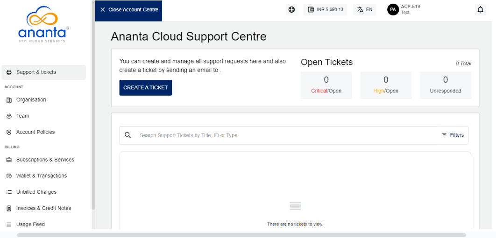

# About Ananta Cloud Support Centre

Ananta Cloud Support Centre is the non-technical (commercial and support) dashboard that you can use to view and manage all the non-technical aspects of an Ananta Cloud account.  You can access the Cloud Support Centre by clicking on any item in **Top-Right User Menu** on the help/support icon in the header, or click the **Header** > Click the **Wallet Icon**.

Ananta Cloud Console offers a one-click view switcher between Account Centre and the Cloud Dashboard.

