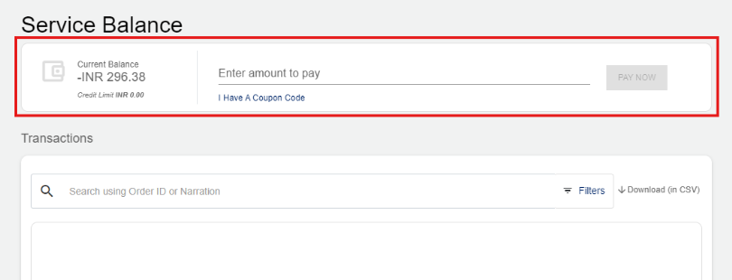
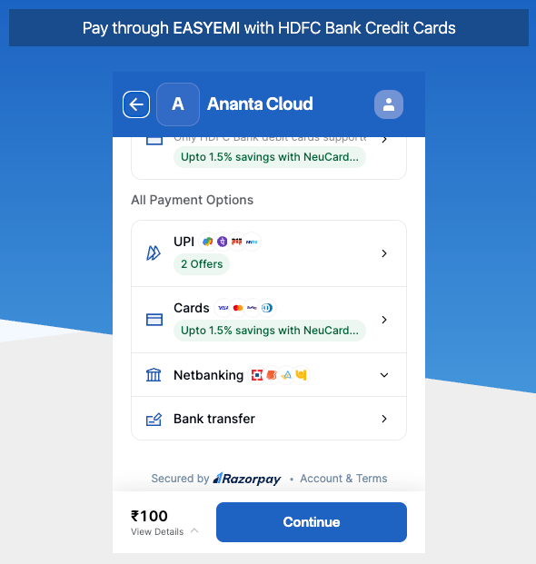
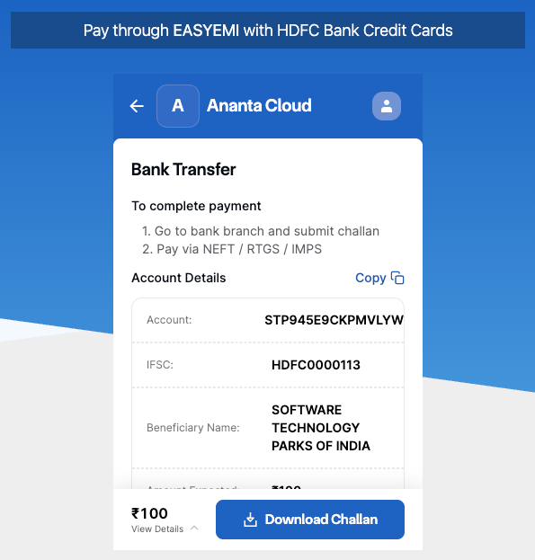

# Payments
You can make payments using both online and offline modes. However, we recommend using the online mode because it is the fastest, safest, and most convenient option. It enables instant transactions, secure processing, and easy tracking of payment history. By using the online payment methods such as netbanking, credit/debit cards, or UPI, you can complete your payment in just a few clicks without the delays associated with offline methods like bank transfer/challan.
## Why Pay Online
Ananta Cloud’s built-in payment system is secure, safe, and compliant with Indian regulations. It enables automatic and faster settlement by detecting payments made through the online system and settling them directly in the portal, ensuring there are no delays in payment confirmation. All transactions are secure and traceable, as payments are routed through authorized banking channels and generate unique transaction references for audit purposes.
## How to Pay Online
You can pay your invoices online using the following options:
- **Direct Online Transfer**
	- **UPI** - Use this option to Make payment using your UPI app such as Gpay, PhonePe, or PayTM.
	- **Cards** - Use this option to make payment via Visa, MasterCard, RuPay or AmEx cards.
	- **Netbanking** - Use this option to make a payment via your bank account.
- **Bank Transfer using Challan** - This option lets you generate a challan online and pay at your bank.
### Online Direct Transfer
To make the online payment, follow these steps:
1. Navigate to **Billing > Wallet & Transactions**. 
2. Under the **Service Balance** section, enter the amount to pay, and click the **Pay Now** button. 
3. Select the desired online payment method: UPI, Cards, and Netbanking. Using this feature, you can specify the amount and also distribute the amount against outstanding invoices or settle it as advance amounts.
4. Click **Continue** to complete the online payment. 
### Bank Transfer Using Challan
To make the bank transfer payment using a challan, follow these steps:
1. Navigate to **Billing > Wallet & Transactions**. 
2. Then, under the **Service Balance** section, enter the amount to pay, and click the **Pay Now** button. 
3. Click **Bank transfer**. The following screen appears:
4. Click **Download Challan** to download the challan in a PDF format to your computer.
5. Print the challan and take it your bank to make the payment. 

When the payment is received, you will receive a confirmation email and your payment details will be uploaded on the Ananta Cloud portal.

:::note
In the event that an online payment failed to get recorded, or if you wish to pay offline (using a cheque, direct bank transfer, or any other payment method), the Ananta Cloud admin will record it as an offline settlement from the backend administration console within 48-72 hours of receiving. You can also top up your service balance by using cash vouchers by entering the coupon code as received from Ananta Cloud platform as part of a marketing campaign or for any other reason.
:::