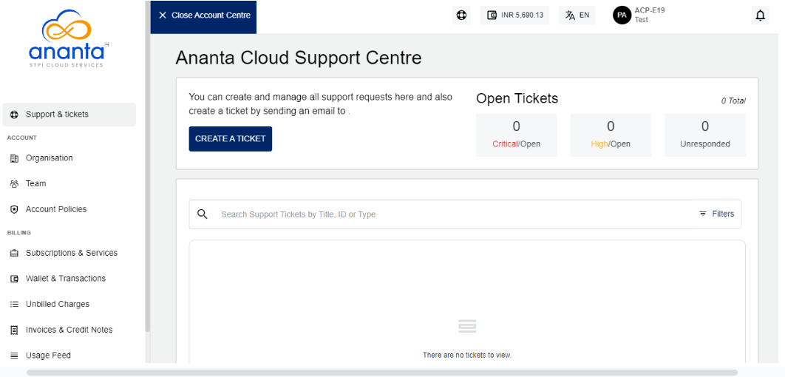
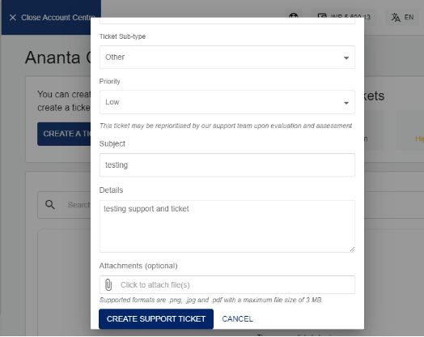

# Support and Tickets

Ananta Cloud provides SLA-driven support to all subscriber customers in accordance with the terms and conditions outlined in the Service Level Agreement. The SLA can be accessed from the top helper bar by clicking on the **user icon**.

## Creating a Support Ticket

The Ananta Cloud Console has a ticketing section that can be accessed by clicking on **Support & Tickets** in the main navigation panel of the Account Centre. The tickets section shows a list of all the tickets in your account and lets you filter the view based on ticket priority and ticket status.

To open the ticket creation dialog box , click on the **CREATE A TICKET** button on the left corner. Ticket creation also follows the single-form interaction paradigm where all the relevant information is captured intelligently in one place to create the ticket. The ticket creation dialog will show the following options:

- **Ticket Type -** This is a high-level classification in terms of Account, Billing, Technical or another issue.
- **Sub-type -** Based on the ticket type chosen above, you’ll be asked to specify a sub-type for further classification.
- **Item -** Based on the type and sub-type combination, you’ll be able to pinpoint exactly which item you’re having an issue with. 
  :::note 
  The Sub-type and Item information is optional but it is recommended that you provide as much information as possible to help Ananta’s support agents diagnose your issue more effectively.
  :::
- **Ticket Details -** Providing a subject, priority, and message/description are mandatory.
- **Attachment -** Optionally, you can also attach a .png, .jpg, or .pdf file as an attachment ,ensuring the file size does not exceed **5MB**.

Creating a ticket will send you a notification email and another email with ticket information that can be used to track and communicate with the support agent(s). Both emails will be received at your email address on record.

## Replying to an Agent

You may reply to the assigned support agent from the ticket interface by using the message box at the bottom of the ticket. You can also upload attachments with your ticket replies.

Alternatively, you can reply to the email that you received with the ticket information or the latest reply from the support agent. Email replies will also show up in the ticket details section on Ananta Cloud Console.

# Ticket Classifiers

Please refer to the following table for a quick reference on ticket classifiers:

|   |   |   |
|---|---|---|
|**Type**|**Sub-type**|**Item**|
|Billing|Transactions|List of transactions to choose from|
||Invoices|List of invoices to choose from|
||Statements|List of statements to choose from|
||Other|-|
|Technical|Virtual Machines|List of VMs to choose from|
||Virtual Private Clouds|List of VPCs to choose from|
||Disks|List of root and addon volumes to choose from|
||Other|-|
|Account|Active Subscriptions|List of active subscriptions to choose from|
||Inactive Subscriptions|List of inactive subscriptions to choose from|
||Users|List of child users to choose from|
||Other|-|
|Other|-|-|

