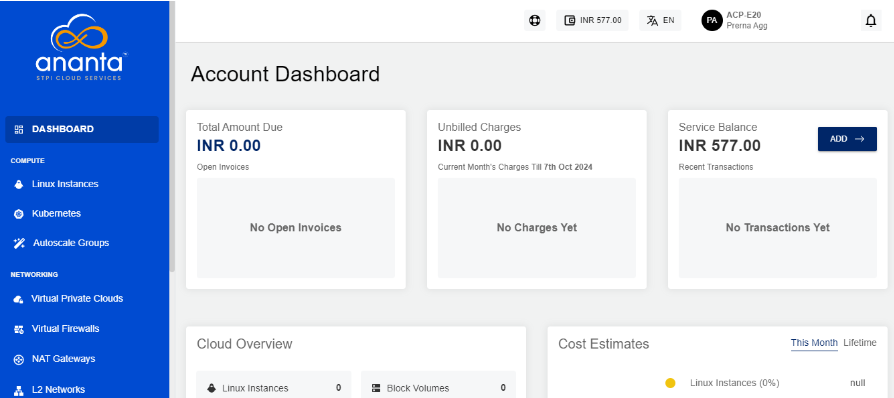

# Cloud Console Overview

Ananta Cloud Console is the white-label CMP (cloud management platform) that subscribers and end-customers will use to manage their cloud as delivered by their service provider. Primarily, cloud management on Ananta Cloud Console has two main 'journey maps' that all end-customers follow as part of their life cycle on Ananta. These are:

- [Cloud Operations Management](CloudOperationsManagement)
- [Account Centre](/docs/AccountCentre/AboutAnantaAccountCentre)

