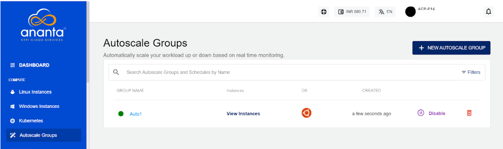

# Creating Autoscale Groups

1. Go to **Compute > Autoscale Groups** in the navigation menu.   
2. Click on the **"NEW AUTOSCALE GROUP"** located at the center of the page.
3. Select an **Instance Category**. 
4. Choose an **Availability Zone** that represents the geographic region for the deployment of your Autoscaled Instance.
5. From the dropdown menus, pick a VPC network under "**Select VPC Network**," choose the appropriate tier in "**Select a Network Tier**," and then select a load balancer from the options in the **"Select Load Balancer"** dropdown
6. Choose an **OS Image** to be run on your Instance.
   
7. Choose a **Compute pack** from the available compute collections.
8. Choose a **Root disk** from the available Disk packs, or alternatively, use the free size option to define the size of the Root Disk.
9. Now, Configure the **Autoscale group** as per your requirement; the options below need to be specified.
	- **Min. Group Limit:** This is the minimum number of members in the Autoscale Group. The number of instances in the group will be equal to or more than this number.
    - **Max. Group Limit:** This is the maximum number of members in the Autoscale Group. The number of instances in the group will be equal to or more than this number.
    - **Expunge VM grace period:** This defines how long before a scale-down is executed should the app/user connections to an Instance be removed.
    - **Polling Interval:** This defines at what interval should the Autoscale Group check your policy conditions and execute the relevant Scale or Scale-down configurations.
1. Next is to define the **Scale Up policy** (Multiple policies can be configured; if multiple conditions are specified, all of them need to be met for the Autoscale Group to execute). You need to specify the following:
	- **Policy Name**
	- **Duration (in mins) -** This is the duration in which the conditions have to be true before action is taken.
	- **Quiet Time (in mins) -** The cool-down period in which the policy should not be evaluated after the action has been taken.
	- **Parameter -** Name of the counter for which the policy will be evaluated.
	    - Parameters: The performance parameters expose the state of the monitored Instances. As of now, there are five new parameters to work with that feature:
		- Instance CPU - average percentage
		- Instance Memory - average percentage
		- Public Network - mbps received per Instance
		- Public Network - mbps transmit per Instance
		- Load Balancer - average connections per Instance
	- **Breach -** Relational Operator to be used with threshold. This will be Greater Than by default.
	- **Threshold -** It is the value for which the Counter will be evaluated with the Operator selected.
1. Then click on the  **ADD CONDITION** to add the policy. If you want to add more policies, click on the **+ ADD NEW** button present beside the Policy name.
2. Then, Define the **Scale Down Policy**; the parameters are similar to the Scale UP policy. Only the breach parameter will be greater than by default.
    
13. Next is to set up the SSH Key. if your account doesn’t have any SSH key pair, then you can use the **Generate a new key pair** option, and you can also upload the key by selecting **Upload a key pair**.
14. If you want to notify your users or custom email addresses upon the execution of this Autoscale Group, then you can select the appropriate option available under Notify on email. i.e., Notify to account users, Notify to comma-separated email addresses.
15. Specify name of your Autoscale group. (Use the naming convention mentioned in the helper text below.)
16. Now, click on the **PUBLISH THIS AUTOSCALE GROUP** button for publishing the Autoscale group.
    

