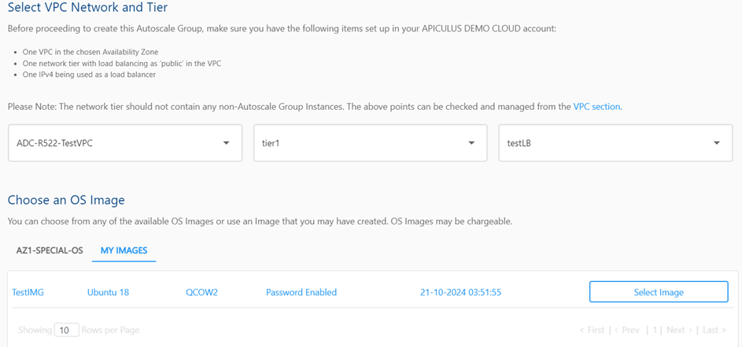

# Using Static Password In Autoscale Group’s VMs

1. Create a VPC and add a network tier inside the VPC.
   

3. Create a Virtual Machine using the standard templates.
   

4. Launch the console and login with the initial password (Generated at the time of VM Creation).
5. Run the following commands. 
	1. Create own password.  `sudo passwd <yourusername>` (ubuntu/root)
	2. Disable the password expiry.  `sudo chage -I -1 -m 0 -M 99999 -E -1 <yourusername>` (ubuntu/root)
	3. Ensure password Authentication is enabled (If using SSH).  `sudo vi /etc/ssh/sshd_config`
	4. Make sure the following lines are set correctly.  `PasswordAuthentication yes` 
	5. Restart the SSH Service.  `sudo systemctl restart ssh`   
	6. Stop the cloud-init service.   `sudo systemctl stop cloud-init` 
	7. Uninstall cloud-init.  `sudo apt purge cloud-init -y` `sudo rm -rf /etc/cloud`  
	9. Remove cloud-init data and configuration.   `sudo rm -rf /var/lib/cloud`   `sudo sed -i '/cloud-init/d' /etc/default/grub`
	11. Remove any cloud-init entry from the grub.  `sudo update-grub`
	12. Reboot the system.  `sudo reboot`

6. Stop The VM from the Ananta portal and create a Root snapshot of that VM.
   

6. Create Image using the Snapshot. (After creation, it will be visible in the **My Image** section).
   

7. Navigate to the VPC section, purchase an IPv4 address, and create a load balancing rule using the acquired IPv4 address.
   

8. Create the Auto Scale Group using the custom template (**My Image**).
   

9. You can now log in to the initial VM using the static password (the same one used for the standard VM). Additionally, you can successfully log in to the secondary VM using the same static password.

