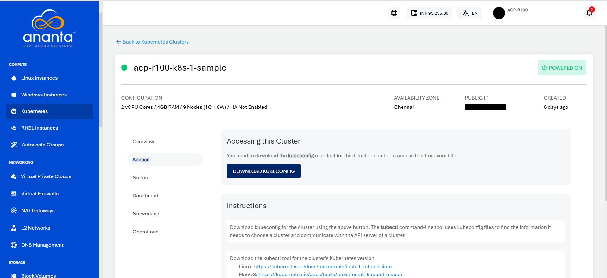

# Accessing a Cluster using the Command Line

Kubernetes clusters can be accessed and controlled from the command line using the **kubeconfig** manifest for the cluster. Each cluster has a unique manifest which is required to identify and target the cluster using the `kubectl` utility.

The manifest for a cluster can be downloaded using the **DOWNLOAD KUBECONFIG** button in the **Access** section of the cluster details.


### Using kubectl

On the CLI, the following command can be used to access the cluster:

```
kubectl --kubeconfig /custom/path/kube.conf {COMMAND}
```

```
List pods kubectl --kubeconfig /custom/path/kube.conf get pods --all-namespaces  
  
List nodes kubectl --kubeconfig /custom/path/kube.conf get nodes --all-namespaces  
  
List services kubectl --kubeconfig /custom/path/kube.conf get services --all-namespaces  
  
Download kubeconfig for the cluster using the above button. The kubectl command-line tool uses kubeconfig files to find the information it needs to choose a cluster and communicate with the API server of a cluster.
```

### Downloading kubectl

The kubectl utility can be downloaded for the correct Kubernetes version from any of these links:

- **Linux:** https://storage.googleapis.com/kubernetes-release/release/v1.23.3/bin/linux/amd64/kubectl  
- **MacOS:** https://storage.googleapis.com/kubernetes-release/release/v1.23.3/bin/darwin/amd64/kubectl  
- **Windows:** https://storage.googleapis.com/kubernetes-release/release/v1.23.3/bin/windows/amd64/kubectl.exe

