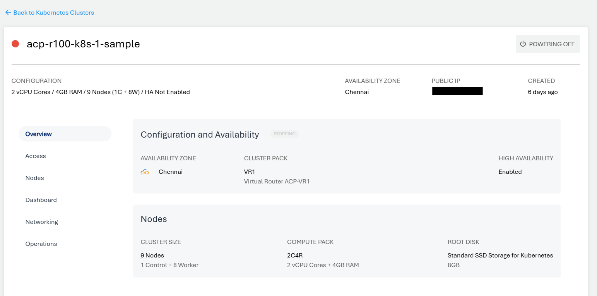
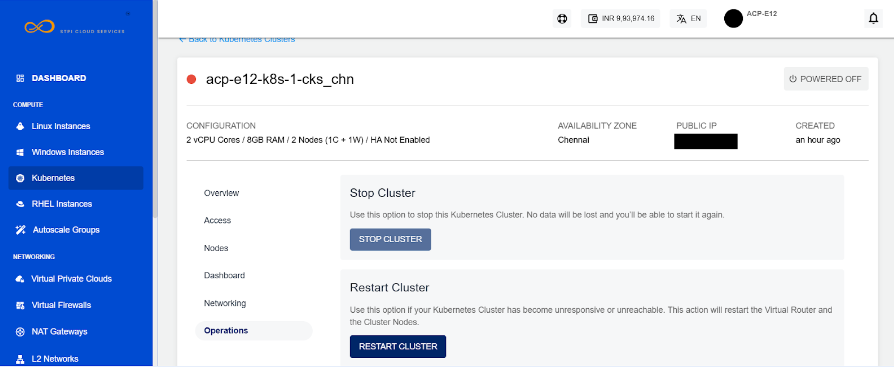
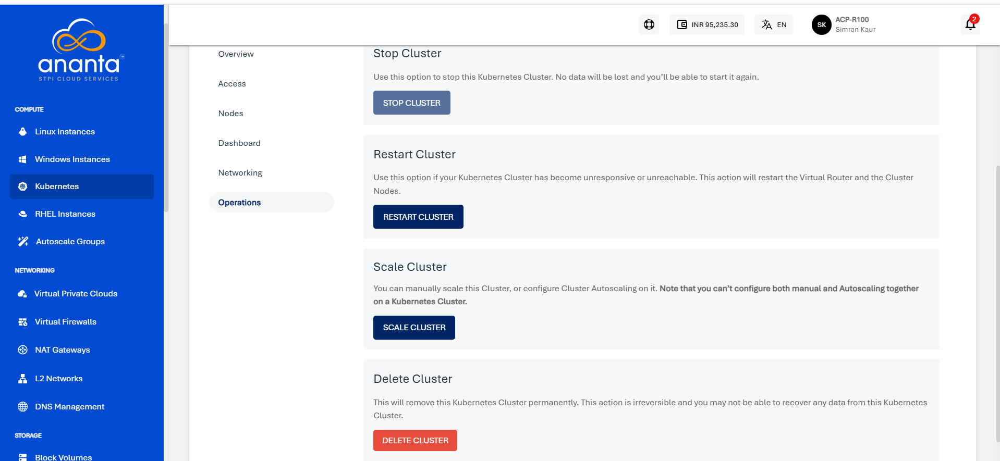

# Cluster Operations
Kubernetes clusters created on Ananta Cloud Console allow for a set of management operations from the Cloud Console UI. While these options can be controlled using **kubectl**, these are provided on the UI for quick and easy access.
## Powering ON/OFF a Cluster
Kubernetes clusters can be powered ON/OFF using the **Power button** on top of the cluster details. This button will typically show in **green** when a cluster is powered ON, and **grey** when powered OFF.

## Stopping and Restarting a Cluster

Kubernetes clusters can be stopped or restarted from the **Operations** section of cluster details.
- **Stop Cluster** - To stop the Kubernetes cluster. No data will be lost, and the cluster can be started again.
- **Restart Cluster** - This action will restart the Virtual Router and the cluster nodes can/should be used if a Kubernetes Cluster has become unresponsive or unreachable.

## Deleting a Cluster

A cluster can be deleted permanently from the **Operations** section under cluster details. This action is irreversible, and no data from a deleted Kubernetes cluster can be recovered.

