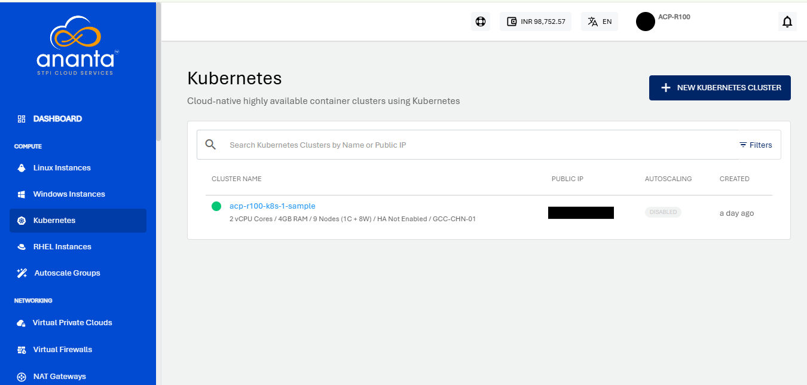

# Creating a Kubernetes Cluster

To create a Kubernetes cluster on an advanced VPC AZ, follow these steps:
1. Navigate to **Compute > Kubernetes**.
	
2. Click on the **+ NEW KUBERNETES CLUSTER** from the top right.
3. Choose an Availability Zone, which is the geographical region where your Kubernetes cluster will be deployed. Kubernetes Clusters can be created only in Availability Zones that support VPC Networking.   
4. Choose a cluster pack from any of the available VPC Network Collections to set up the Kubernetes Cluster.
5. Public IP will be selected by default.
6. Choose a compute pack from the available compute collections.   
7. You need to define the various cluster options listed below:
    1. You can enable the high availability HA for the cluster.
    2. Specify the cluster size, i.e., the no. of worker nodes. 
    3. Specify the node root disk size; a minimum of 8GB is required 
    4. Choose Kubernetes version
	
9. Verify the Estimated Cost of your Kubernetes Cluster based on the specifications you have chosen from the Summary and Estimated Costs Section (Here, both the Hourly and Monthly Prices summary will be displayed)
10. Click on the check box after going through the policies your cloud service provider mentioned.
11. Click on the BUY HOURLY or BUY MONTHLY button and Click on the **CONFIRM** to create the Kubernetes Cluster.
    
	:::note
	This might take up to 5-8 minutes. You may use the Cloud Console during this time, but it is advised that you do not refresh the browser window.
	:::
Once ready, you’ll be notified of this purchase on your email address on record. The newly created Kubernetes cluster can be accessed from **Compute >** **Kubernetes** on the main navigation panel.

