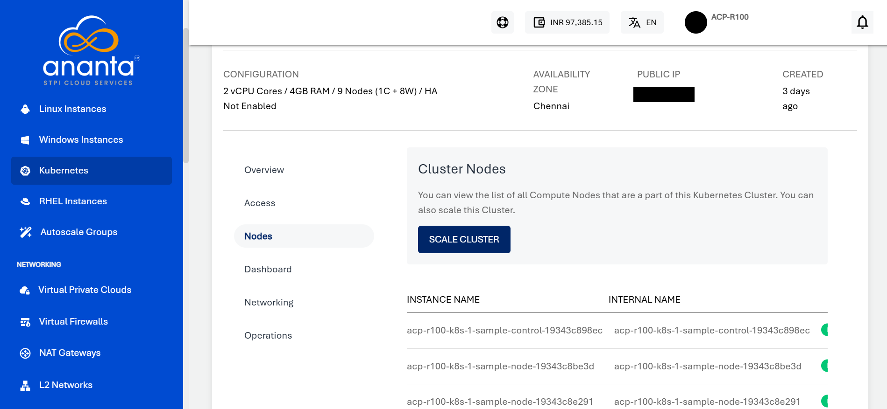
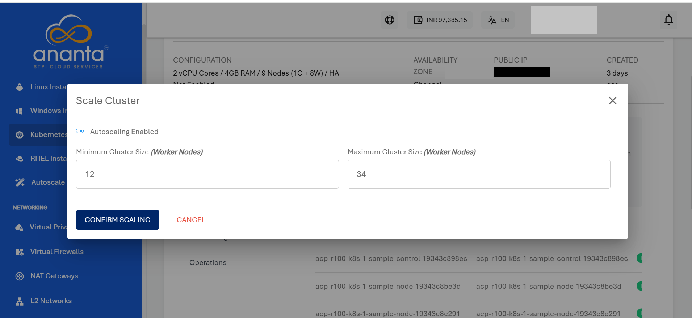

# Scaling Kubernetes Clusters

Ananta Cloud Console allows for manual and automatic cluster scaling. Clusters scaling can be configured from the **Nodes** section of cluster details.

## Manually Scaling a Cluster

1. Under **Nodes**, click on **SCALE CLUSTER**, and a pop over will appear; keep 'autoscaling' disabled.
   
2. Select one of the available compute packs.
3. Click on **CONFIRM SCALING**.
   
## Automatically Scaling a Cluster

1. Under **Nodes**, click on **SCALE CLUSTER**, and a popover will appear, enable 'autoscaling' by flipping the switch.
2. Enter the minimum and maximum number of worker nodes.
3. Click on **CONFIRM SCALING**.
   

