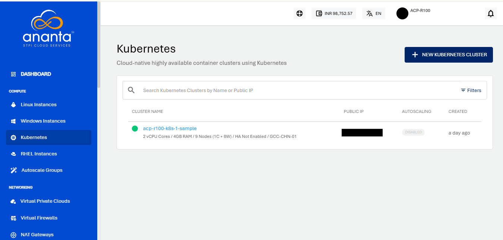
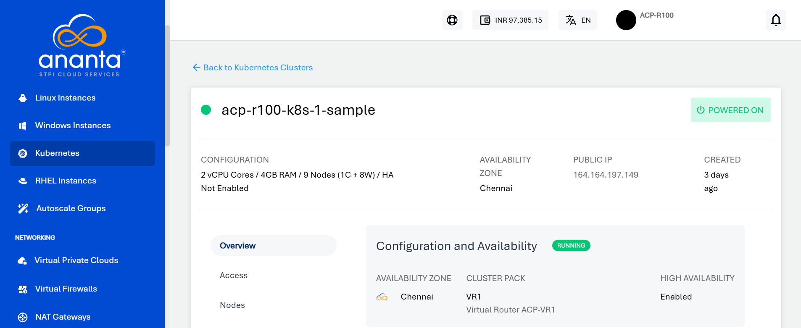
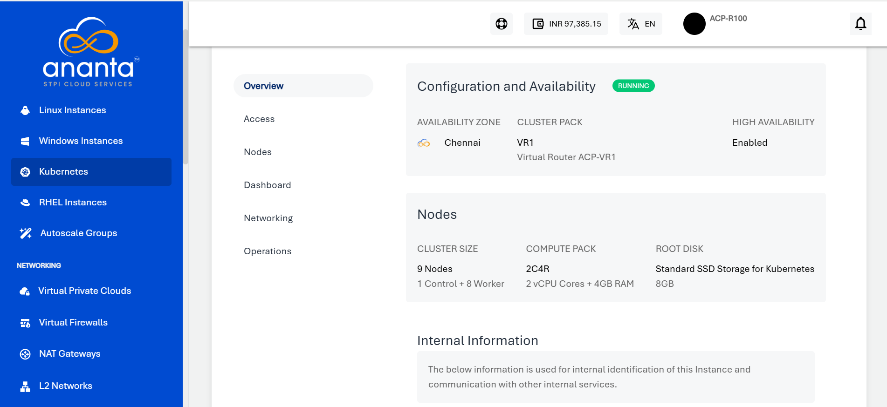

# Viewing Kubernetes Cluster Details

Ananta Cloud Console offers a detailed view of Kubernetes clusters on the UI. Ananta also brings the full power and accessibility of cluster management via the **kubectl** interface.

To view cluster details on the UI, follow these steps:

1. Navigate to **Compute > Kubernetes**
2. All the Kubernetes clusters for your account will be listed here with the following details.
    1. Kubernetes Cluster Name (Along with the configuration details)
    2. Public IP address
    3. Autoscaling Enabled/Disabled
    4. Created 

To  view a list of sections and the various actions you can perform inside the particular section, click the **Kubernetes Cluster** name. Below the cluster name is an informational view where you can find the below details.

- Configuration
- Availability Zone
- Cluster Pack
- High Availability Enabled/Disabled

A quick option is available in the top right corner, i.e., to  **POWER OFF/ON** the cluster.

At this stage, the following details can be accessed for the cluster:

1. **Configuration and Availability**
    1. The cluster’s status, **RUNNING**, is displayed in Green, whereas **STOPPED** is displayed in greyed out.
    2. Information about the VPC networking zone.

2. **Nodes Information**- This displays the basic information about the nodes as listed below.
    1. Cluster Size
    2. Computed Pack
    3. Root disk size
3. **Internal Information**- This displays the information used for internal identification of this Cluster and communication with other internal services.
    1. Kubernetes Version
    2. Virtual router internal name
    3. Created on

Additionally, other sections will be available on the left which can then be used to view and access various aspects of managing the Kubernetes cluster. These are:

- **Access** - To view detailed instructions on how to access the cluster using **kubectl**.
- **Nodes** - To view the cluster nodes (control and worker) and also scale the cluster.
- **Dashboard** - To view detailed instructions on how to access the Kubernetes dashboard for the cluster.
- **Networking** - To manage ingress networking rules.
- **Operations** - To perform basic management operations on the cluster.

