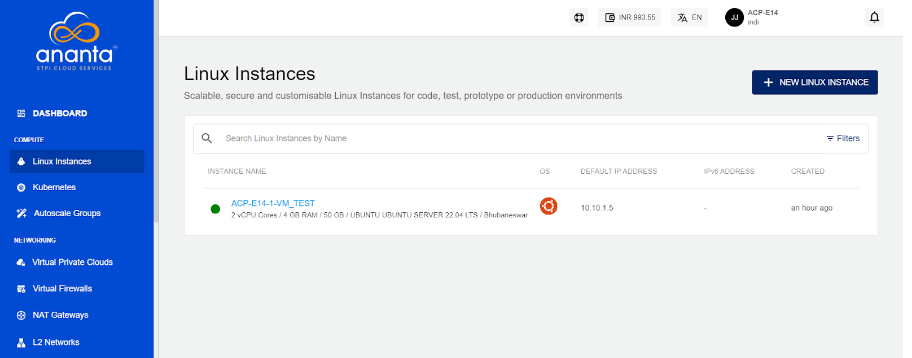
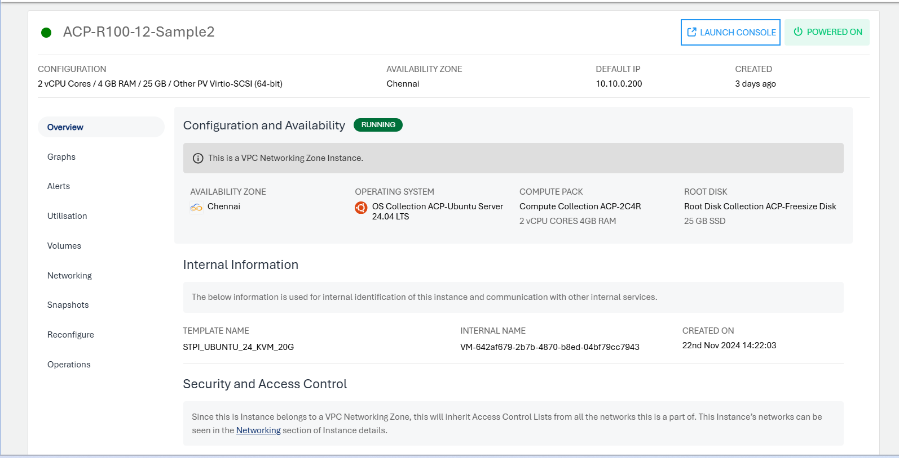

# About Linux Instances

Instances are computing units that provide you with resources to run your applications/workloads. Linux Instances are virtual machines that run the images of Linux Operating Systems, for example, Ubuntu, CentOS, Rocky, Oracle, Debian, etc.

Before creating a Linux instance, it is important to plan the architecture, networking and access to the Linux Instances. 

Ananta offers a highly usable and visual way of working with and operating Linux Instances using the Cloud Console. You can access all the Linux Instances available in your account in the following way:

1. Navigate to **Compute > Linux Instances**.
2. All the Linux instances for your account are listed here with the following details:
	- Instance Name and the configuration details
	- OS Icon
	- Default IP Address
	- Created

To view a list of sections and the various actions you can perform by going inside the particular section, click the **instance name**. Below the instance name, you will find an informational view displaying the following details:

- Configuration
- Availability Zone
- Default IP
- Created 

On the top right corner, two quick options are available, one to **LAUNCH CONSOLE** and the other to **POWER OFF/ON** the Instance.

Details on available Linux Instance operations and actions can be found in their respective sections.

- [Overview](ViewingDetailsofLinuxInstances.md)
- [Graphs & Utilisation](ViewingGraphsandUtilizationofLinuxInstances.md)
- [Alerts](ConfiguringAlertsonLinuxInstances.md)
- [Volumes](VolumeManagementwithLinuxInstances.md)
- [Networking](NetworkingManagementwithLinuxInstances.md)
- [Snapshots](WorkingwithLinuxInstanceSnapshots.md)
- [Reconfigure](ReconfiguringLinuxInstances.md)
- [Operations](LinuxInstanceOperations.md)

