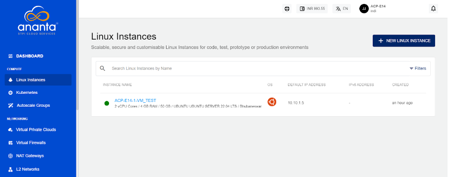

# Creating Linux Instances

Before creating a Linux instance, it is important to plan the architecture, networking and access to the Linux Instances. 

To create a Linux instance, follow these steps:
1. Navigate to **Compute > Linux Instances**.
    
2. Click on **NEW LINUX INSTANCE**.
3. Choose an **Availability Zone**, which is the geographical region where your Instance will be deployed. 
4. Select the **Destination** (VPC/VNF) and then the **Network** from the respective drop-down lists.   
5. **Choose an OS Image** to run on your Instance.
6. **Choose a Compute Pack** from the available compute collections.   
8. **Choose a Root Disk** from the available options.
9. Select the option to **Protect this Instance**.
10. In **Choose Instant Apps**, select the available applications. To Verify/Login into your selected database, refer to [App Overlays](AppOverlays.md). 
    
11. **Choose an Authentication Method**:
    - **Use SSH key pair**: Click on the Use SSH key pair option; all the SSH key pairs present in your account will be listed. If your account does not have any SSH key pair, then you can click the **Generate a new key pair** option or upload the key pair by clicking the **Upload a key pair** option. 
    - **Use root user password**: On selecting Use root user password, the **Also email me the password** option is displayed. If you select this option, the password, along with the details, for instance, will be emailed to your registered email ID.
12. In the **Name Your Linux Instance** field, enter the desired name for your Linux Instance. The Instance name must only contain alphanumeric characters, underscore, dots and hyphens. 
    
13. Under the **Summary and Estimated Costs** section, verify the estimated cost of your Linux Instance based on the chosen specifications.
14. To confirm, click on the check box after reviewing the policies mentioned by your cloud service provider.
15. Click on the **BUY HOURLY** or **BUY MONTHLY** button. The Confirm Instance Purchase window appears, and the price summary is displayed along with the discount codes if you have any in your account. 
    - You can apply any of the discount codes listed by clicking on the **APPLY** button. 
    - You can also remove the applied discount code by clicking the **REMOVE** button. 
    - You can cancel your action by clicking the **CANCEL** button.
16. To create the Linux Instance, click on the **CONFIRM** button.
    

:::note
It might take up to 5-8 minutes for the Linux instance to get created. You may use the Cloud Console during this time, but it is advised that you do not refresh the browser window.
:::

Once ready, you will be notified of this purchase on your registered email ID. The newly created Linux Instances can be accessed from **Compute >** **Linux Instances** on the main navigation panel.