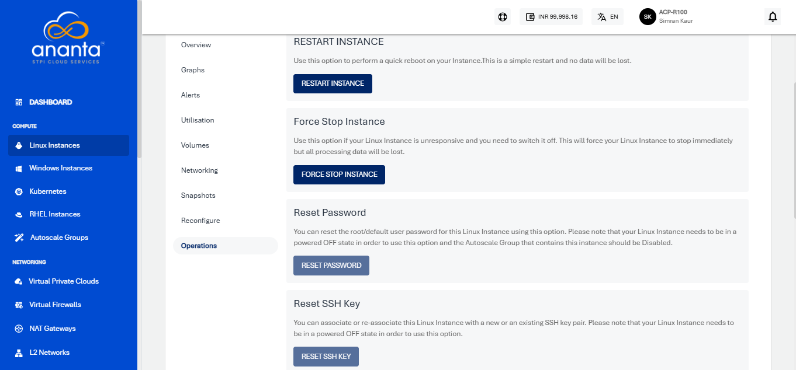

# Linux Instance Operations

From [Operating Linux Instances](AboutLinuxInstances.md), navigate into a Linux Instance and access the **Operations** tab to see all available Instance operations.

Ananta Cloud Console provides the options to perform the following operations on Linux Instances:

- **Restart Instance** - Perform a quick reboot on your Instance. This is a simple restart, and no data will be lost.
- **Force Stop Instance** - Force stop a running or a hung Linux Instance.
- **Reset Password** - Reset the Linux Instances root user password. This requires the Linux Instance to be powered off.
- **Reset SSH Key** - Reset the Linux Instances SSH key association. This requires the Linux Instance to be powered off.
- **Rename Instance** - Rename the Linux Instance.
- **Migrate Instance** - Migrate Linux Instance between VPC networks within the same Availability Zone.
- **Reinstall Instance** - Restore this Instance to its original configuration by reinstalling its Operating System or choosing a new one. Choosing a new Operating System image may have an additional billing component if it is a priced Operating System.
- **Delete Instance** - Delete the Linux Instance.   
  :::warning
  Deleting a Linux Instance will remove it entirely along with its subscription and is a non-reversible action.
  :::

