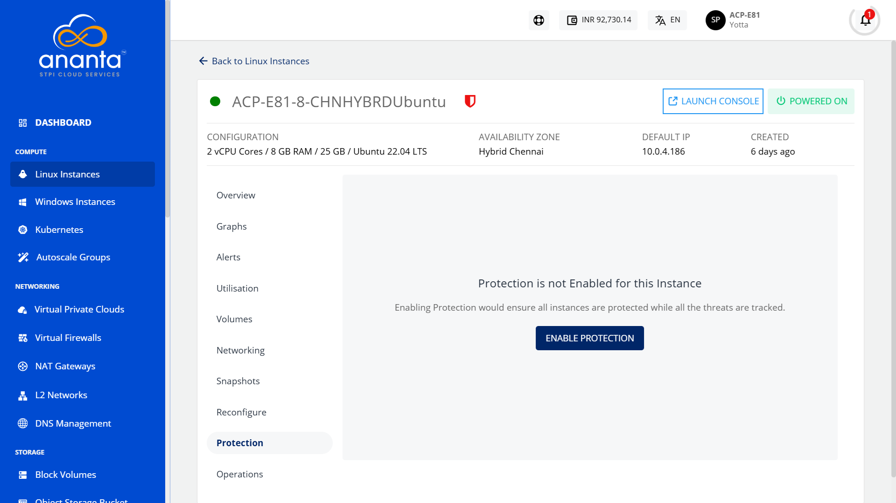
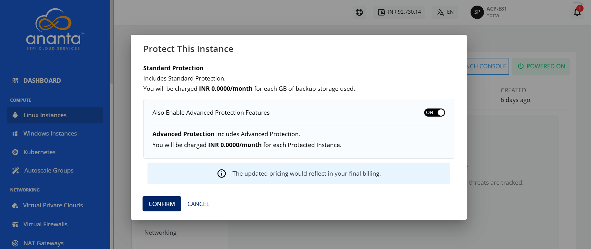
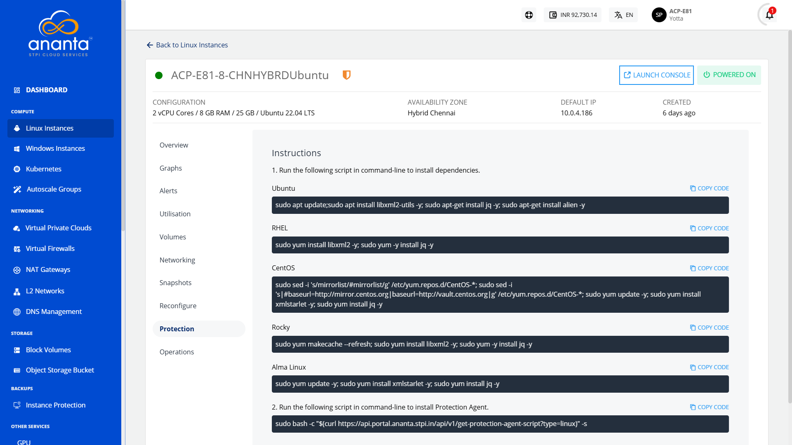

# Protecting Linux Instances

Enabling protection ensures that all instances are protected while all the threats are tracked.

To enable instance protection, follow these steps:

1. From [Operating Linux Instances](AboutLinuxInstances.md), navigate into a Linux Instance and access the **Protection** tab.
2. Click on the **Enable Protection** button. The following screen appears where the standard protection service is selected.
3. To enable advanced protection features such as antivirus, anti-malware and backup/restore service for the SQL databases, turn on the toggle button. 
4. Click **Confirm**. The protection gets enabled and the following screen appears:
5. Run the respective script (mentioned under Point No. 1) in command-line to install dependencies.
6.  Run the script mentioned on the screen (mentioned under Point No. 2) in command-line to install Protection Agent.

