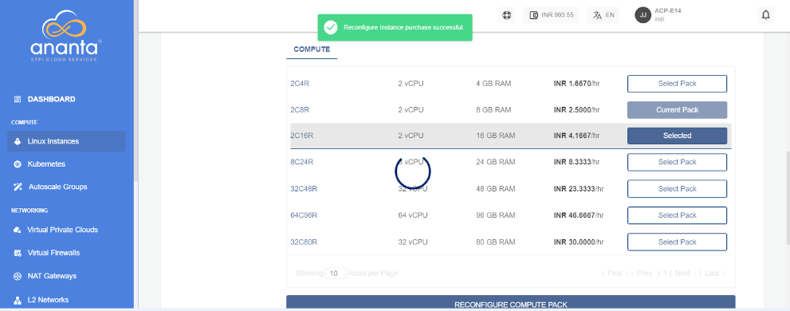

# Reconfiguring Linux Instances

To access the **Reconfigure** tab and to view available reconfiguration options, navigate to a Linux Instance from [Operating Linux Instances](AboutLinuxInstances.md).

A Linux Instance on Ananta can be reconfigured in the following ways:

- Billing interval changed between monthly and hourly.
- Choosing and applying a new Compute pack.
- Choosing and applying a new Root Disk pack.

:::note
You can only reconfigure with the same billing interval. If you wish just to change the billing interval, please use the **Switch Plan** button. It is recommended to switch the plan first before reconfiguring the instance if you wish to use both the Reconfigure and Switch Plan options. You will be charged according to the new plan you reconfigure, not the previous one.
:::

