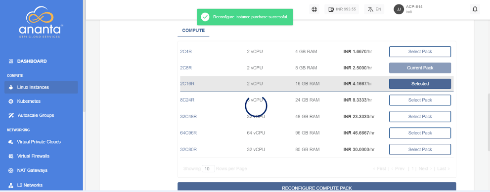

# Reconfiguring Linux Instances

To access the **Reconfigure** tab and to view available reconfiguration options, navigate to a Linux Instance from [ Linux Instances Screen](AboutLinuxInstances.md).

A Linux Instance on Ananta can be reconfigured in the following ways:

- The Billing interval changed between monthly and hourly.
- Choosing and applying a new Compute pack.
- Choosing and applying a new Root Disk pack.

:::note
You can only reconfigure the Instance with the same billing interval. To change the billing interval, use the Switch Plan button. It is recommended to switch the plan before reconfiguring the Instance if you intend to use both the Reconfigure and Switch Plan options. Charges will be applied based on the reconfigured pack, not the previous pack.
:::

