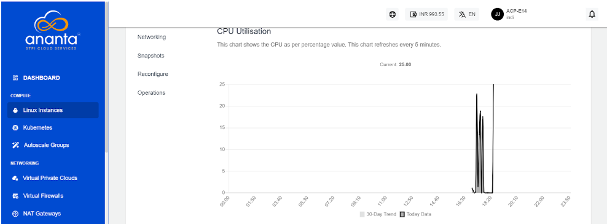

# Viewing Graphs and Utilization of Linux Instances

## Graphs (Real-time)

To view the available graphs and monitor the instance in real time, navigate to a Linux instance from [Operating Linux Instances](AboutLinuxInstances.md) and access the **Graphs** tab.

You can use these graphs to understand Instance utilisation patterns and create custom alerts.

The following graphs are available on a 24-hour time-scale graph with a 30-day trend line for the following parameters:

- CPU Utilisation
- RAM Utilisation
- Network Input
- Network Output

## Utilisation (Historical)

From [Operating Linux Instances](AboutLinuxInstances.md), navigate into a Linux Instance and access the **Utilisation** tab to view historical usage across supported parameters.  

The Utillisation table shows a historical date-wise details of daily maximum, minimum, and average readings for all parameters. The utilisation report is downloadable as a **.csv** file. 

