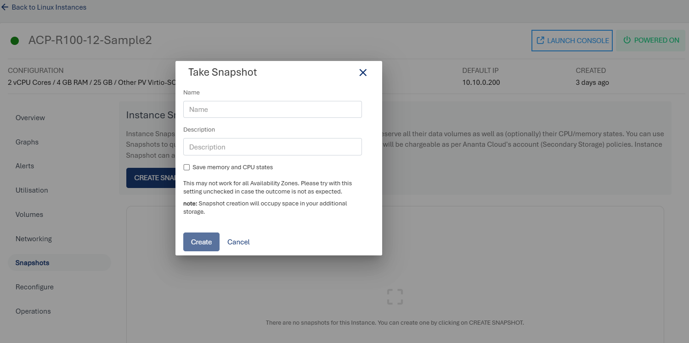

# Working with Linux Instance Snapshots

To access the **Snapshots** tab and to view all the snapshots taken for particular Instance, navigate to a **Linux Instance** from [Operating Linux Instances](AboutLinuxInstances.md).

Instance Snapshots allow you to create point-in-time images of instances that preserve all their data volume as well as (optionally) their CPU/memory states. You can use Snapshots to quickly restore Instances.

The Snapshots section shows all the Linux Instance snapshots, which can be used to revert the Linux Instances to an earlier state.

A snapshot lists the following details:

- Snapshot Name
- Internal Name
- Description
- Type
- Created On

The following quick options are available:
- Revert the Instance from the snapshot
- Delete the snapshot
## Creating a Snapshot
To create a snapshot, follow these steps:
- To open the **Take Snapshot** window, click the **CREATE SNAPSHOT** button.
- Enter the name and description for the snapshot.
- To create the snapshot, click the **Create** button.

