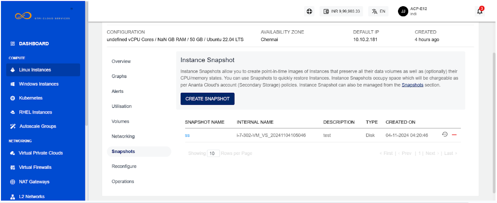
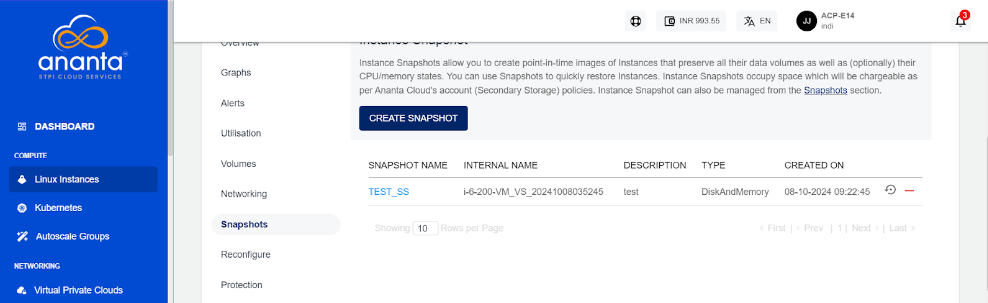

# Working with Linux Instance Snapshots

From [Operating Linux Instances](AboutLinuxInstances.md), navigate into a Linux Instance and access the **Snapshots** tab to see all the snapshots taken for this Instance.

Instance Snapshots allow you to create point-in-time images of instances that preserve all their data volume as well as (optionally) their CPU/memory states. You can use Snapshots to quickly restore Instances.

The Snapshots section shows all the Linux Instance snapshots, which can be used to revert the Linux Instances to an earlier state.

A snapshot lists the following details:

- Snapshot Name
- Internal Name
- Description
- Type
- Created On

The following quick options are available:
- Revert the Instance from the snapshot
- Delete the snapshot
## Creating a Snapshot
To create a snapshot, follow these steps:
1. Click on the **CREATE SNAPSHOT** button. The Take Snapshot window appears.
2. Enter the name of the snapshot and the description of the snapshot. 
3. Click on the Create button. The snapshot will be created.

