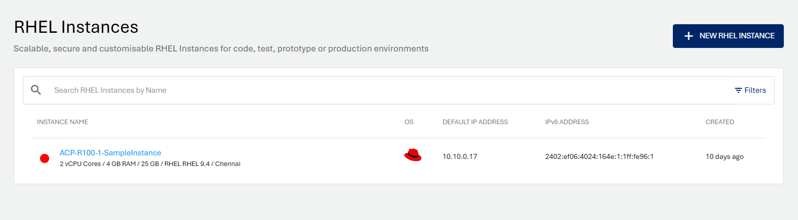
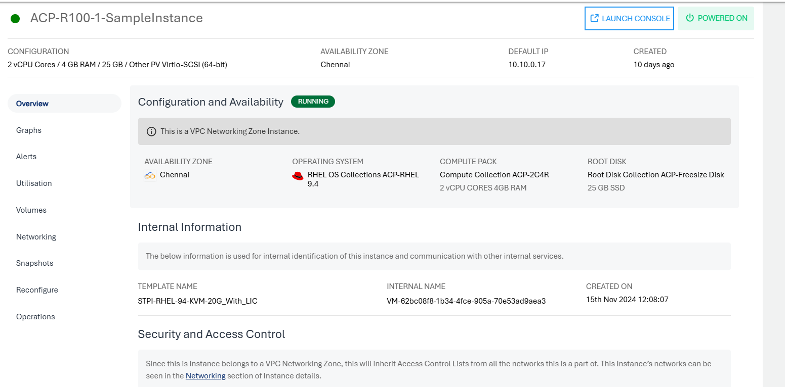

# About RHEL Instances

Instances are computing units that provide you with resources to run your applications/workloads. Red Hat Enterprise Linux (RHEL) Instances are virtual machines that run the images of RHEL Operating System.

The Ananta platform offers a flexible and granular pricing model for Red Hat Enterprise Linux (RHEL) based on virtual CPU (vCPU) core slabs. This model allows organizations to tailor costs to their actual resource usage, making it a versatile option for businesses with varying workload demands.

Ananta provides tiered pricing for RHEL by supporting the following core categories:

- **1-8 vCPUs**: This slab is suitable for small to medium workloads, typically found in lightweight applications, development environments, and smaller production workloads. Pricing in this range is designed to be competitive, allowing users to optimize costs for modest resource requirements.
    
- **9-128 vCPUs**: This middle tier accommodates larger workloads, such as those seen in extensive application environments, data processing, and medium-to-large production systems. Pricing for this range is aligned with Red Hat's standard, making it easier to manage costs as applications scale up.
    
- **129+ vCPUs**: Designed for enterprise-grade deployments, this category caters to highly intensive applications requiring significant compute resources. These could include data analytics, machine learning workloads, and large-scale production systems. Ananta ensures that pricing is optimized for businesses managing large virtualized environments with high vCPU demands.
    

Each slab follows Red Hat's established core model, ensuring transparent and predictable pricing while offering the flexibility to manage resources effectively. By aligning with Red Hat's structure, Ananta makes it easier for businesses to plan costs accurately as they scale across different workload sizes.

Before creating an RHEL instance, it is important to plan the architecture, networking and access to the RHEL Instances.

Ananta offers a highly usable and visual way of working with and operating RHEL Instances using the Cloud Console. All RHEL Instances available in your account can be accessed in the following way:

1. Navigate to **Compute > RHEL Instances**.
2. All the RHEL instances for your account are listed here with the following details:
	- Instance Name and the configuration details
	- OS Icon
	- Default IP Address
	- IPv6 Address
	- Created

To view the list of sections and the various operations or actions you can perform within each section, click on the instance name.

Below the Instance name, there is an informational view where you can find the following details:
- Configuration
- Availability Zone
- Default IP ADDRESS
- Created 

On the top right corner, two quick options are available, one to **Launch Console** and the other to **POWER OFF/ON** the Instance.
 
Details on available RHEL Instance operations and actions can be found in their respective sections on the left.

- [Overview](ViewingDetailsofRHELInstances.md)
- [Graphs](ViewingGraphsandUtilizationofRHELInstances.md)
- [Alerts](ConfiguringAlertsonRHELInstances.md)
- [Utilisation](ViewingGraphsandUtilizationofRHELInstances.md)
- [Volumes](VolumeManagementwithRHELInstances.md)
- [Networking](NetworkingManagementwithRHELInstances.md)
- [Snapshots](WorkingwithRHELInstanceSnapshots.md)
- [Reconfigure](ReconfiguringRHELInstances.md)
- [Operations](RHELInstanceOperations.md)

