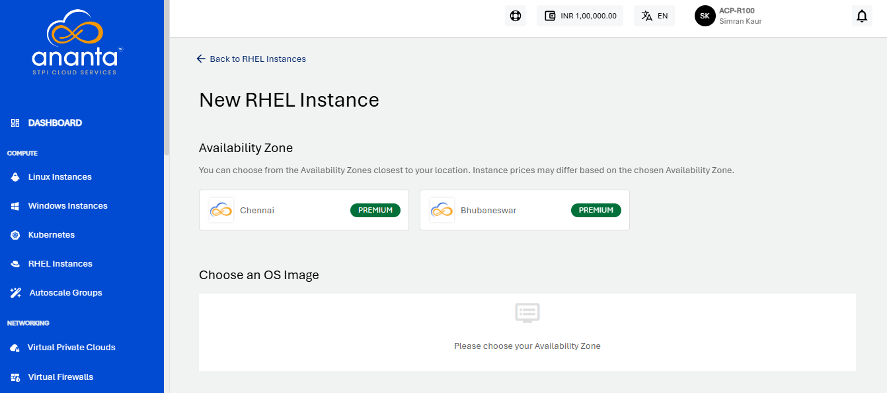

# Creating RHEL Instances
Before creating a RHEL instance, it is important to plan the architecture, networking and access to the RHEL Instances. 

To create a RHEL instance, follow these steps:

1. Navigate to **Compute > RHEL Instances**.
   
2. Click on the **NEW RHEL INSTANCE**.
   
3. Choose an **Availability Zone**, which is the geographical region where your Instance will be deployed. 
4. Select the **Destination** and then the **Network** from the drop-downs.
5. **Choose an OS Image** to run on your Instance.
6. **Choose a Compute Pack** from the available compute collections.
   
7. **Choose Disk Configuration** from the available **SSD**/**HDD** disk packs, or you can use the free size option to specify the root disk.
8. Select the option to **Protect this Instance**.
9. **Choose an Authentication Method**: 
    - **Use SSH key pair**: Clicking on the Use SSH key pair option, all the SSH key pairs present in your account will be listed; if your account doesn’t have any SSH key pair, then you can click the **Generate a new key pair** option or upload the key pair by clicking the **Upload a key pair** option. 
    - **Use root user password**: On selecting Use root user password, **Also email me the password** option is displayed. If you select this option, the password, along with the details, for instance, will be emailed to your registered email ID.
    
10. In the **Name Your RHEL Instance** field, enter the desired name for your RHEL instance.
11. Verify the Estimated Cost of your RHEL Instance based on the specifications you have chosen from the Summary and Estimated Costs section (Here both Hourly and Monthly Prices summary will be displayed).
12. To confirm, click on the check box after going through the policies mentioned by your cloud service provider.
13. Clicking on the **BUY HOURLY** or **BUY MONTHLY** button, the Confirm Instance Purchase window appears, and the price summary is displayed along with the discount codes if you have any in your account. 
    1. You can apply any of the discount codes listed by clicking on the **APPLY** button. 
    2. You can also remove the applied discount code by clicking the **REMOVE** button. 
    3. Clicking on the **CANCEL** button, this action will be canceled.
    
16. Click on the **CONFIRM** to create the RHEL Instance.

:::note
It might take up to 5-8 minutes for the instance to create. You may use the Cloud Console during this time, but it is advised that you do not refresh the browser window.
:::

Once ready, you will be notified of this purchase on your registered email address. To access the newly created RHEL Instances, navigate to **Compute >** **RHEL Instances**.

