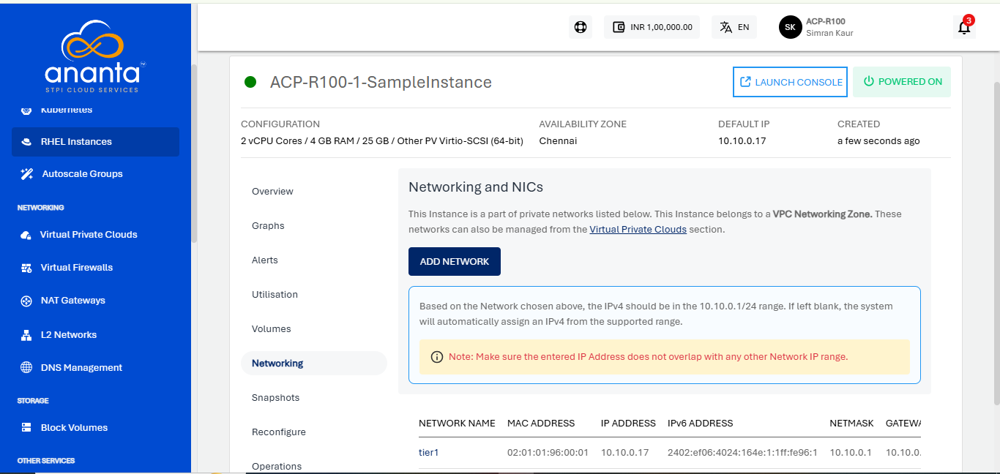

# Networking Management with RHEL Instances

To view the networks attached to RHEL Instance, navigate to  [RHEL Instances](AboutRHELInstances.md), and access the **Networking** tab

The Networking and NICs section will list all the networks that a RHEL Instance is attached to.

The following actions are available:

- If the Instance is inside a VPC, you can associate the Instance to multiple tiers within the VPC or share the Instance with other VPC networks in the same Availability Zone by using the **ADD NETWORK** option.
- Network/tier associations can be removed from this section by using the **Unlink** action.

:::note
Advanced networking configurations can be done using the [Virtual Private Clouds](/docs/Networking/VirtualPrivateClouds/AboutVirtualPrivateClouds) service.
:::

