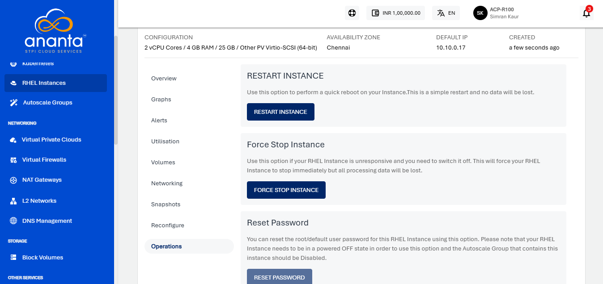

# RHEL Instance Operations

To view all available Instance operations, from [RHEL Instances](AboutRHELInstances.md) and access the **Operations** tab.

Ananta Cloud Console provides the options to perform common operations on RHEL Instances.

- **Restart Instance** - Perform a quick reboot on your Instance. This is a simple restart, and no data will be lost.
- **Force Stop Instance** - Force stop a running or a hung RHEL Instance.
- **Reset Password**- Reset the RHEL Instances root user password. This requires the RHEL Instance to be powered off.
- **Reset SSH Key** - Reset the RHEL Instances SSH key association. This requires the RHEL Instance to be powered off.
- **Rename Instance** - Rename the RHEL Instance.
- **Migrate Network** - Migrate RHEL Instance between VPC networks within the same Availability Zone.
- **Reinstall Instance** - Restore this Instance to its original configuration by reinstalling its Operating System or choosing a new one. Choosing a new Operating System image may have an additional billing component if it is a priced Operating System. 
- **Delete Instance** - Delete the RHEL Instance. 
  :::warning
  Deleting a RHEL Instance will remove it entirely along with its subscription and is a non-reversible action.
  :::

