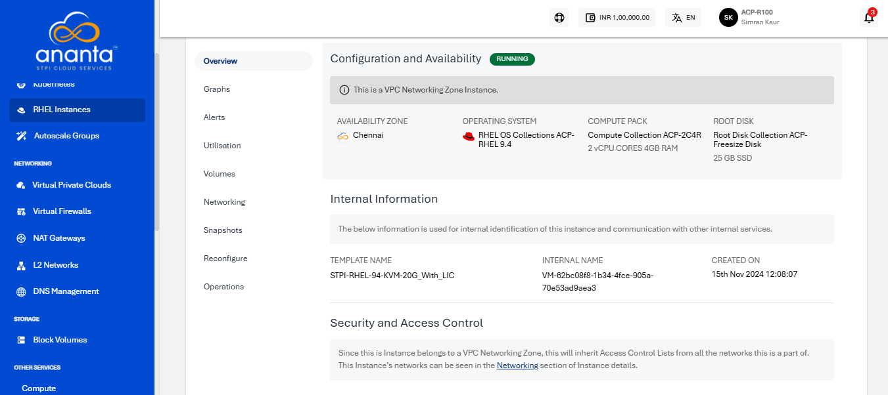

# Viewing Details of RHEL Instances

To view the details below, navigate to [RHEL Instance](AboutRHELInstances.md), select a RHEL Instance and access the **Overview** tab.

- [Configuration and Availability](#configuration-and-availability)
- [Internal Information](#internal-information)
- [Security and Access Control](#security-and-access-control)
---
## Configuration and Availability
The instance's status, **RUNNING**, is displayed in **green**, whereas STOPPED is displayed in greyed out.

## Internal Information
This displays the information that is used for internal identification of this instance and communication with other internal services.
    - Template Name
    -  Internal Name
    -  Created On
## Security and Access Control
The following information is avaialble:
	- Network Name
	- VPC Name
	- Access Control

