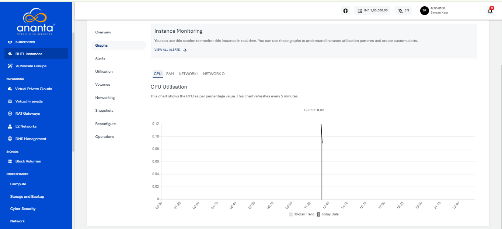
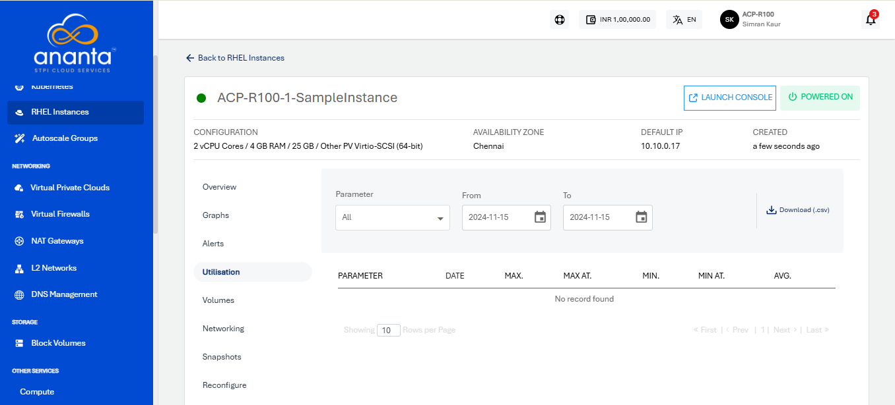

# Viewing Graphs and Utilization of RHEL Instances

## Graphs (Real-time)

Navigate to a [RHEL Instance](AboutRHELInstances.md) and access the **Graphs** tab to see the available graphs and monitor this instance in real-time.

You can use these graphs to understand Instance utilisation patterns and create custom alerts.

The following graphs are available on a 24-hour time-scale graph with a 30-day trend line for the following parameters:

- CPU utilisation
- RAM utilisation
- Network Input
- Network Output

## Utilisation (Historical)

Navigate into a [RHEL Instance](AboutRHELInstances.md) and access the **Utilisation** tab to view historical usage across supported parameters. 

The Utillisation table shows a historical date-wise details of daily maximum, minimum, and average readings for all parameters. The utilisation report is downloadable as a _.csv_ file. 

