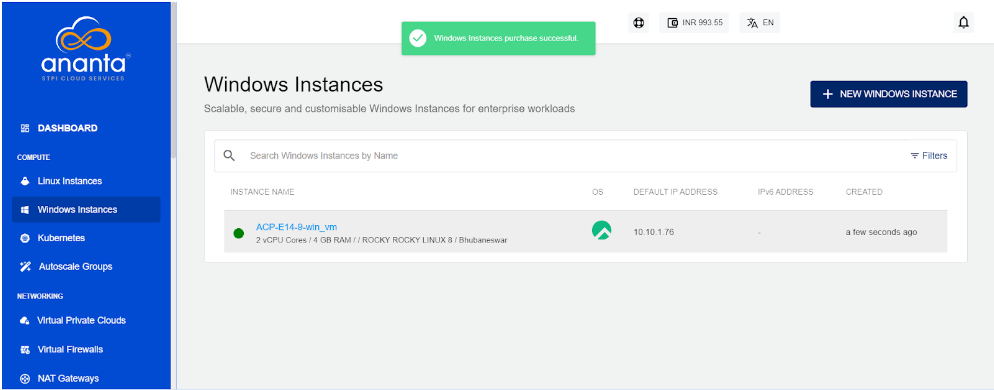

# About Windows Instances

Instances are computing units that provide you with resources to run your applications/workloads. Windows Instances are virtual machines that run the images of Windows Operating Systems.

Before purchasing a Windows Instance, it is important to plan the architecture, networking, and access to the Windows Instances. As a thumb rule:

- You can use a Windows Instance to get started quickly and set up your Windows Instances behind Ananta Cloud’s global server load balancer (GSLB) and control access by setting up virtual firewall rules; or;
- You can use a ‘tiered’ network (or Advanced VPC, virtual private cloud) Windows Instances to configure advanced networking and application architectures and control access by setting up access control lists.

Ananta offers a highly usable and visual way of working with and operating Windows Instances using the Cloud Console. All Linux Instances available in your account can be accessed in the following way:

1. Navigate to **Compute > Windows Instances**.
2. All the Windows Instances for your account will be listed here with the following details
    - Instance Name (Along with the configuration details)
    - OS- Icon will be displayed.
    - Default IP Address
    - Created

To view a list of sections and the various operations or actions you can perform within a particular section, click the instance name. Below the instance name, an informational view will appear, where you can find the following details:
- Configuration
- Availability Zone
- Default IP
- Created 

On the top right corner, two quick options are available, one for accessing the Instance console Instance and the other to POWER OFF/ON the instance.

Details on available Windows Instance operations and actions can be found in their respective sections.

- [Overview](ViewingDetailsofWindowsInstances)
- [Graphs & Utilisation](ViewingGraphsandUtilisationofWindowsInstances)
- [Alerts](ConfiguringAlertsonWindowsInstances)
- [Volumes](VolumeManagementwithWindowsInstances)
- [Networking](NetworkingManagementonWindowsInstances)
- [Snapshots](WorkingwithWindowsInstanceSnapshots)
- [Reconfigure](ReconfiguringWindowsInstances)
- [Operations](WindowsInstanceOperations)

