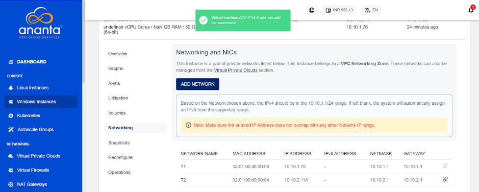

# Networking Management on Windows Instances

To view the networks associated with Instance, navigate to [Operating Windows Instances](AboutWindowsInstances), select a Windows Instance and access the **Networking** tab.

The following actions are available:
- If the Instance is inside a VPC, you can associate the Instance to multiple tiers within the VPC or share the Instance with other VPC networks in the same Availability Zone by using the **ADD NETWORK** option.
- Network/tier associations can be removed from this section by using the unlink action.

:::note
Advanced networking configurations can be done using the [Virtual Private Clouds](/docs/Networking/VirtualPrivateClouds/AboutVirtualPrivateClouds) service.
:::

