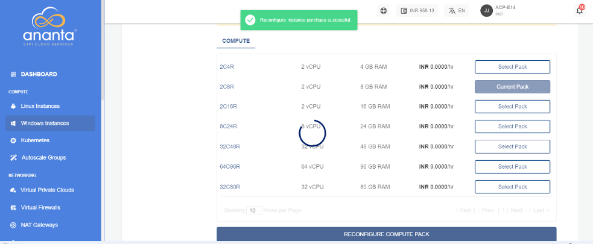

# Reconfiguring Windows Instances

From [Operating Windows Instances](AboutWindowsInstances), navigate into a Windows Instance and access the **Reconfigure** tab to see available reconfiguration options.

A Windows Instance on Ananta can be reconfigured in the following ways:

- Billing interval changed between monthly and hourly.
- Choosing and applying a new Compute pack.
- Choosing and applying a new Root Disk pack.

:::note
Reconfiguration can only be performed with the same billing interval. If you wish to change the billing interval, please use the "Switch Plan" button. To utilize both the "Reconfigure" and "Switch Plan" options, it is recommended to switch the plan first before reconfiguring the instance. Please note that charges will be based on the newly reconfigured plan, not the previous one.
:::

