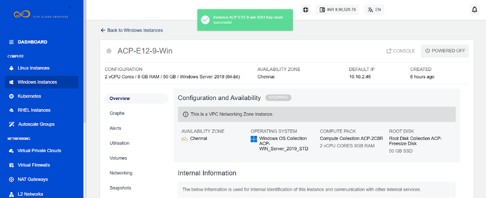

# Viewing Details of Windows Instances

To view the details navigate to [Operating Windows Instances](AboutWindowsInstances), select a Windows Instance and access the **Overview** tab.

1. **Configuration and Availability**
    1. The instance's status, **RUNNING**, is displayed in Green, whereas **STOPPED** is displayed in greyed out.
    2. Information about the networking zone (VPC networking zone).

2. **Internal Information** - This displays the information that is used for internal identification of this instance and communication with other internal services.
    1. Template Name
    2. Internal Name
    3. Created On
3. **Security and Access Control** - Depending on the networking zone, the information and operations will be available here.
4.  For VPC Networking zone, the following information will be shown:
    1. Network Names
    2. VPC Name
    3. Access Control

