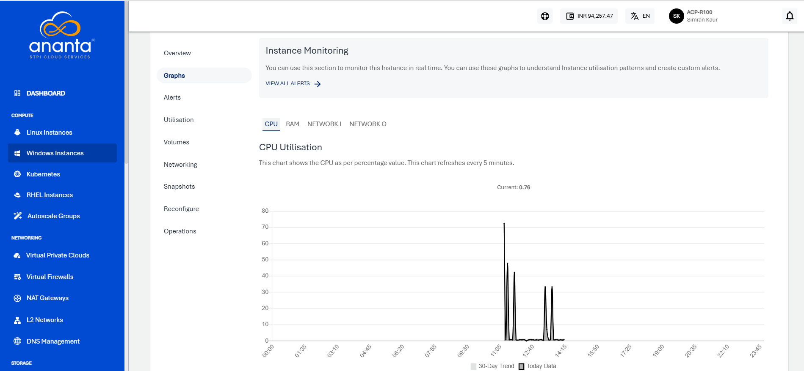

# Viewing Graphs and Utilisation of Windows Instances

## Graphs (Real-time)

To view the available graphs and monitor the instance in real-time, navigate to [Operating Windows Instances](AboutWindowsInstances), select a Windows Instance and access the **Graphs** tab. 

You can use these graphs to understand Instance utilisation patterns and create custom alerts.

The following graphs are available on a 24-hour time-scale graph with a 30-day trend line for the following parameters:

- CPU utilisation
- RAM utilisation
- Network I utilisation
- Network O Utilisation

## Utilisation (Historical)

to view historical usage across supported parameters, navigate to [Operating Windows Instances](AboutWindowsInstances), select a Windows Instance and access the **Utilisation** tab .

The Utillisation table shows a historical date-wise details of daily maximum, minimum, and average readings for all parameters. The utilisation report is downloadable as a _.csv_ file.

