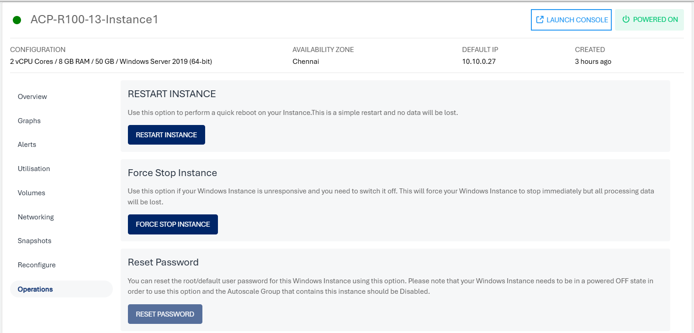
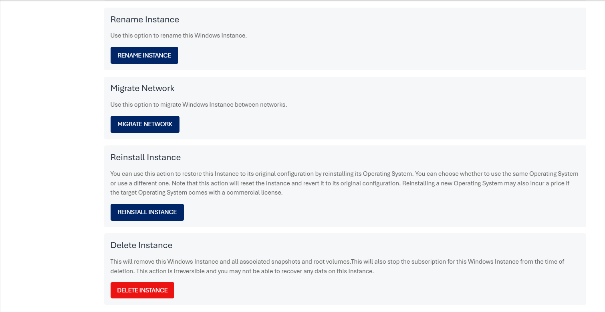

# Windows Instance Operations

To view all the available Instance operations, navigate to [Operating Windows Instances](AboutWindowsInstances), select a Windows Instance and access the **Operations**.

Ananta Cloud Console provides the following options to perform common operations on Windows Instances:
- **Restart Instance** - Use this option to perform a quick reboot on your Instance. This is a simple restart, and no data will be lost.
- **Force Stop Instance**- To forcefully stop a running or a hung Windows Instance.
- **Reset Password**- To reset the Windows Instances root user password. This requires the Linux Instance to be powered off.
- **Rename Instance** - To rename the Windows Instance.
  
- **Migrate Instance** - To migrate Windows Instance between VPC networks within the same Availability Zone.
- **Reinstall Instance** - To restore this Instance to its original configuration by reinstalling its Operating System or choosing a new one. Choosing a new Operating System image may have an additional billing component if it's a priced Operating System.
- **Delete Instance** - To delete the Windows Instance. 
	:::note 
	Deleting a Windows instance will remove it entirely along with its subscription and is a non-reversible action.
	:::
  

