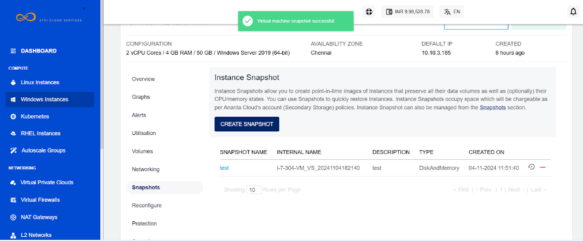

# Working with Windows Instance Snapshots

To view all the snapshots taken for the instance, navigate to [Operating Windows Instances](AboutWindowsInstances), select a Windows Instance and access the **Snapshots** tab.

Instance Snapshots allow you to create point-in-time images of Instances that preserve all their data volume as well as (optionally) their CPU/memory states. You can use Snapshots to quickly restore Instances.

The Snapshots section shows all Windows Instances snapshots, which can be used to revert the Windows Instances to an earlier state.

Snapshot will list down the following details:

- Snapshot Name
- Internal Name
- Description
- Type
- Created On

Two quick options are available, one is to revert the Instance from the snapshot, and the other is to delete the particular snapshot.

To create a snapshot, click the **CREATE SNAPSHOT** button. It will prompts you for the name  and the description of the snapshot. Click **Create** to generate the snapshot, or click **Cancel** to abort the action.

