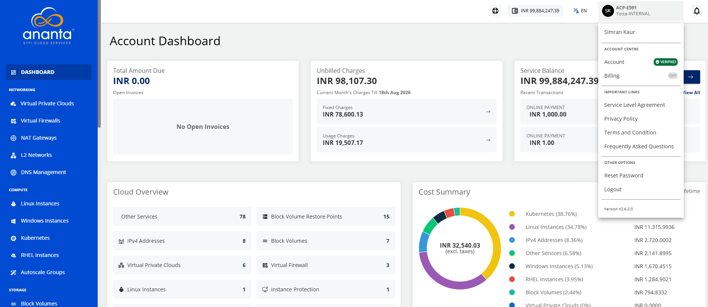
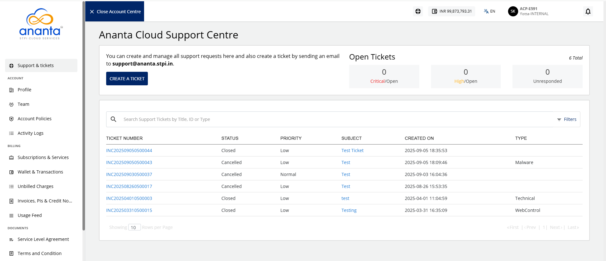

# About Ananta Cloud Support Centre

Ananta Cloud Support Centre is the non-technical (commercial and support) dashboard that you can use to view and manage all the non-technical aspects of an Ananta Cloud account. 

To access the cloud support centre, follow these steps:
1. Click the **User** icon. The following screen appears:
2. Navigate to **Account Centre > Account**. 
3. Navigate to **Support & tickets**. The following screen appears:

Ananta Cloud Console offers a one-click view switcher between Account Centre and the Cloud Dashboard.

