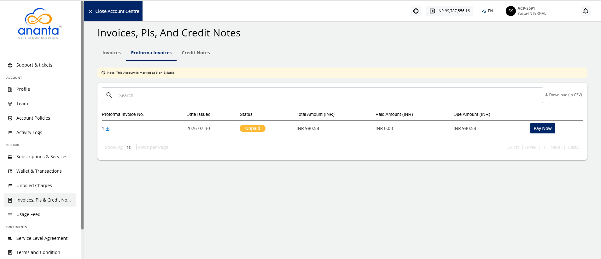
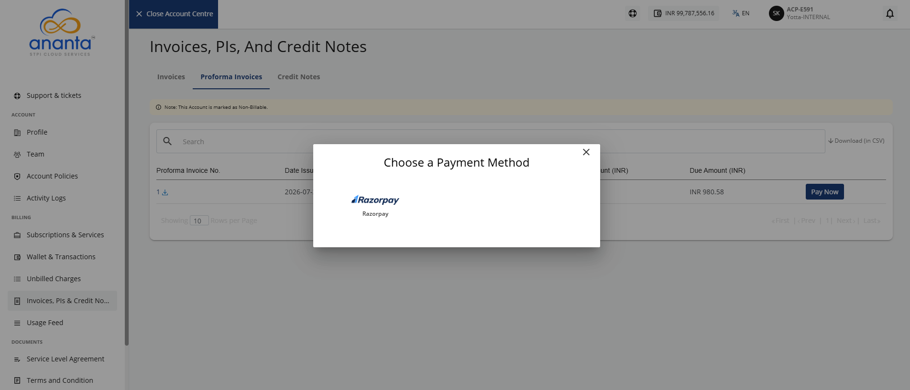
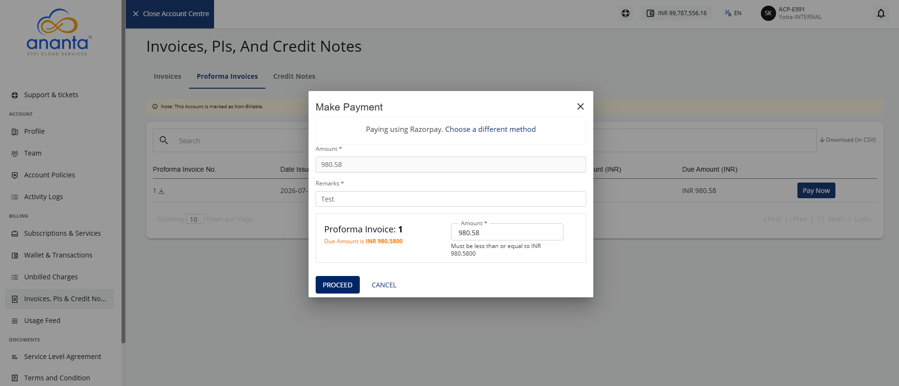
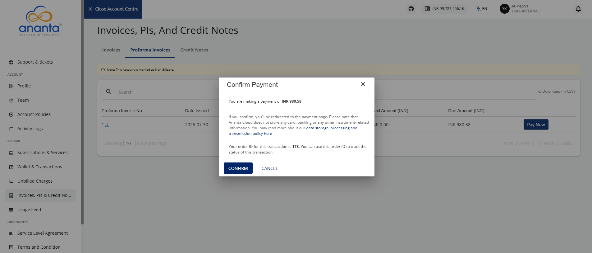

# Making Payment Against a Proforma Invoice

This section covers the steps for making a payment against a Proforma Invoice, which is a preliminary invoice issued before the final invoice and is typically used to facilitate advance payments for added services.

To pay a Proforma Invoice, follow these steps:

1. Navigate to **Account Centre > Billing** and click the **Invoices, PIs and Credit Notes** tab. 
2. Click the **Proforma Invoices** tab. The following screen appears:
3. Click the **Pay Now** button. The following screen appears: 
4. Select the payment method. The following screen appears:
5. Provide the following details:
	-  **Remarks**
	-  **Amount** you want to pay.
6. Click the **Proceed** button. The following screen appears: 
7. Click the **Confirm** button.

You will be redirected to the payment gateway page to complete the payment.

