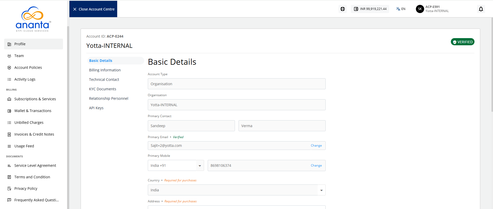

# Organisation/Account Profile

Using the **Profile** section, you can manage your organisation account profile on Ananta Cloud. 

To access the profile section, navigate to **Account Centre > Account** , and click the **Profile** tab.

Provide the following information in the respective sections:

1. **Basic Details**: These are the basic demographic details of your organisation. All editable fields can be updated at any time.
2. **Billing Information**: These are the billing details for your organisation, for example:  billing address, taxation ID, etc.
3. **Technical Contact**: These are the details for billing and technical contacts in your organisation.
	:::note 
	These contacts are not child users and do not get login credentials.
	:::
4. **KYC Documents**: This section can be used to upload various organisational documents, for example: company registration information, taxation ID documents, proofs of address, etc. 
	:::note 
	Ananta might require these documents to allow continued usage of the cloud services.
	:::
5. **Relationship Personnel**: This section shows the point of contact details that have been assigned to your account by the service provider.
6. **API Keys**: This sections shows the region, API key and secret key.

