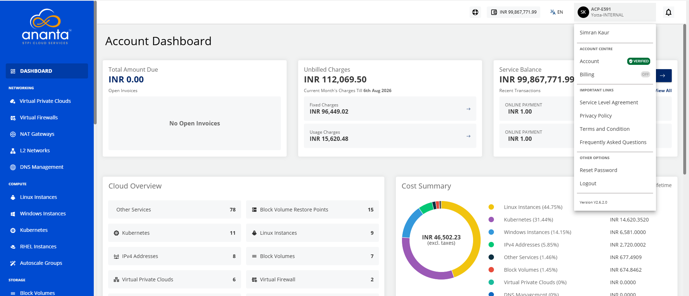
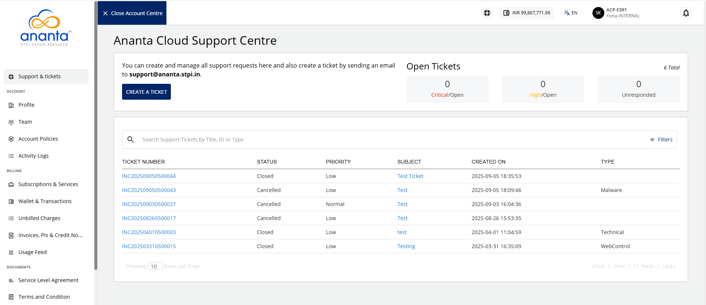
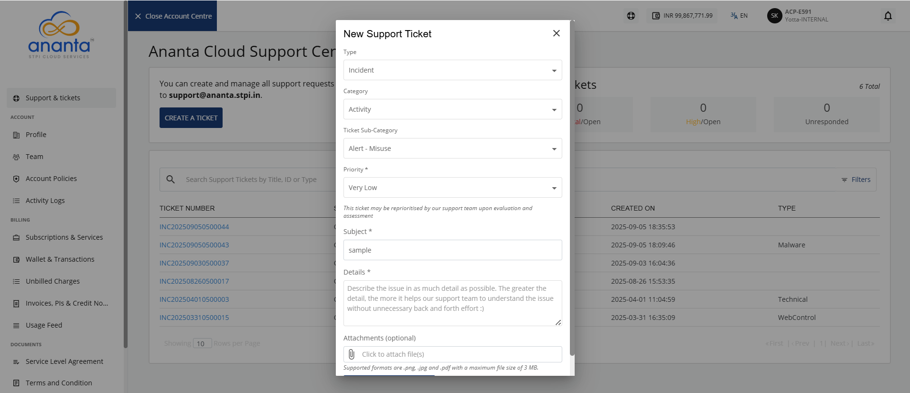
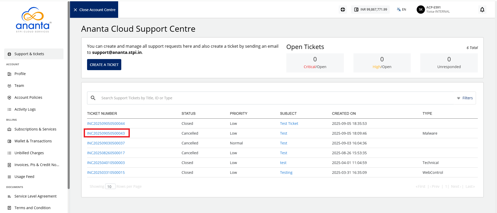
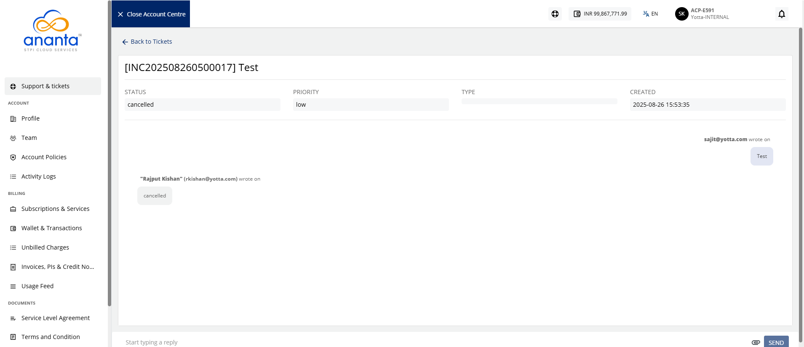

# Support and Tickets

NGC provides support according to the terms and conditions defined in the Service Level Agreement. You can use the **Support & Ticket** section to create, track, and manage your tickets. You can raise tickets for incidents, service requests, or change requests and communicate directly with the assigned support agent.

To access the **Support & Tickets** menu, click the **user** icon and navigate to **Account Centre > Account**.

The following screen appears:

## Creating a Support Ticket

To create a support ticket, follow these steps:
1. Click the **Support & Tickets** menu. The following screen appears:
    
2. Click the **Create a Ticket** button. The following screen appears:
3. Provide the following details:
	- **Type:** Select the appropriate high-level classification, such as Incident, Service Request, or Change Request. [Click here](#ticket-classifiers) to view the categories and sub-categories.
	- **Category:** Select the appropriate category (For example: Accounts, Antivirus, Apache SQL Injection Attack, Backup) based on the ticket type.
	- **Ticket Sub Category:** Select the appropriate subcategory according to the selected category.
	- **Priority:** Select the appropriate priority level (Very Low, Low, Normal, High) based on the impact and urgency of the ticket.
	- **Subject:** Enter a clear and descriptive ticket subject.
	- **Details:** Enter the complete ticket description.
	- **Attachment:** Optionally, attach a .png, .jpg, or .pdf file. Ensure that the file size does not exceed **5 MB**.
4. Click the **Create Support Ticket** button.

After successfully creating the ticket, you get a notification email and a separate email containing the ticket details on your registered email id. You can use the ticket information to track the request and communicate with the support agent(s).

## Communicating with an Agent

To communicate with an agent, follow these steps:
1. Click **Ticket Number** (highlighted in red).
	The following screen appears:
2. Enter your message in the textbox. You can also upload attachments along with your message.
3. Click **Send**.

 You can also reply directly to the email containing the ticket information or the latest response from the support agent.

## Ticket Classifiers

The following table is a quick reference on ticket classifiers:

| **Category** | **Sub Category**        |
| ------------ | ----------------------- |
| Activity     | Alert -misue            |
|              | New Requirement         |
| AIX          | Alert- Profiled         |
|              | New Requirement         |
| AppSecure    | Availability            |
|              | Backup/Restore/Recover/ |
|              | BAU Activity            |
|              | Capacity                |
| Audit        | Application             |
|              | Database                |
|              | Network                 |
|              | New Requirement         |

