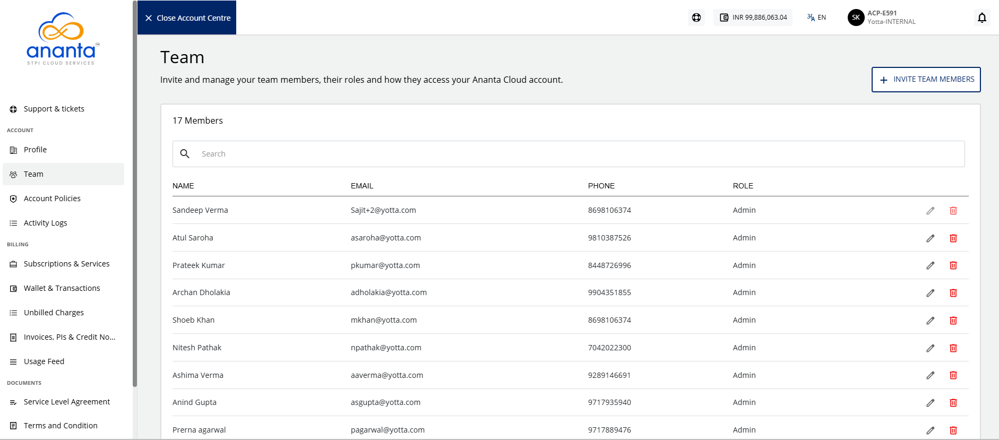
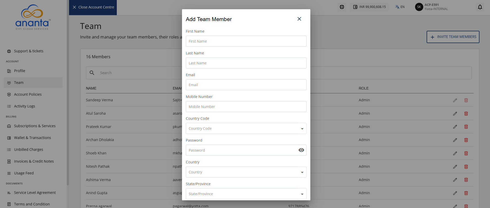

# Team and Child User Management

Team members or child users can be onboarded using the Team section from the account centre. Ananta Cloud allows you to add billing, technical, or other admin users who can log in to your account and perform operations.

To add a child user, follow these steps:
1. Click the **User** icon. The following screen appears:
2. Navigate to **Account Centre > Account** >**Team**. The following screen appears:
3. Click the **Invite Team Members** button. The following screen appears, where you provide the required details:
	:::note
		The child user can reset the password from the Ananta Cloud Console.
	:::
	:::note
		For Group dropdown menu, select from the following options:
		- **Admin:** Gets access to all functionalities.
	    - **Billing:** Gets permissions to perform billing actions and read-only for other actions.
	    - **Technical:** Gets permissions to perform technical actions and read-only for other actions.
	::: 
4. Click the **Create** button.

The child user receives an email notification at the email address provided during account creation. They can then log in to the Ananta Cloud Console and access the available features based on the role assigned to them.

:::note
The first/default user supersedes all other admin users, which means that while admin users can edit or remove other users, only the default user can delete other admin users.
:::

