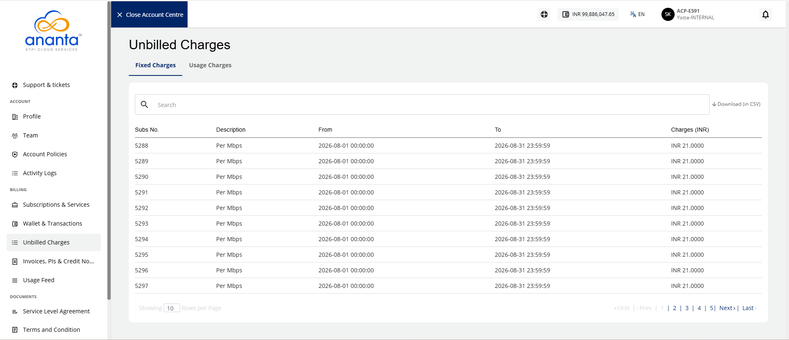

# Unbilled Charges
All subscriptions incur prorated charges during an account’s billing cycle. These incurred charges are also known as unbilled charges. 

This section covers the following charges:
- **Fixed Charges:** Unbilled charges for fixed (recurring or non-recurring) subscriptions are prorated daily by default. 
- **Usage Charges**: Unbilled charges for usage subscriptions show the actual incurred charges till the last hour.

To access the unbilled charges, navigate to **Billing > Unbilled Charges**.

