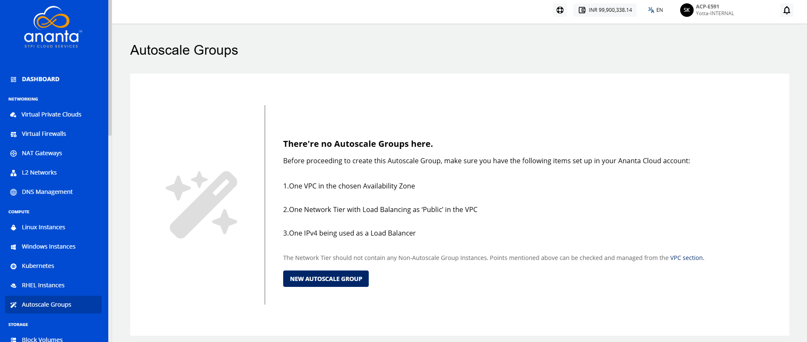
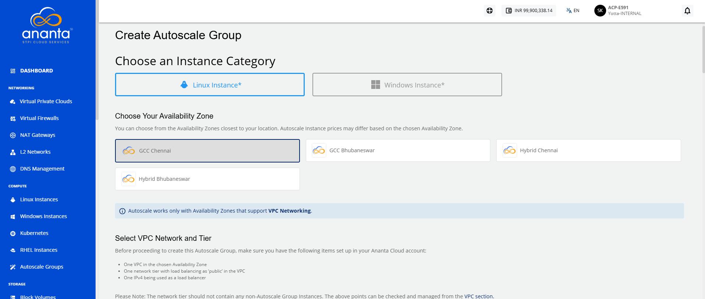
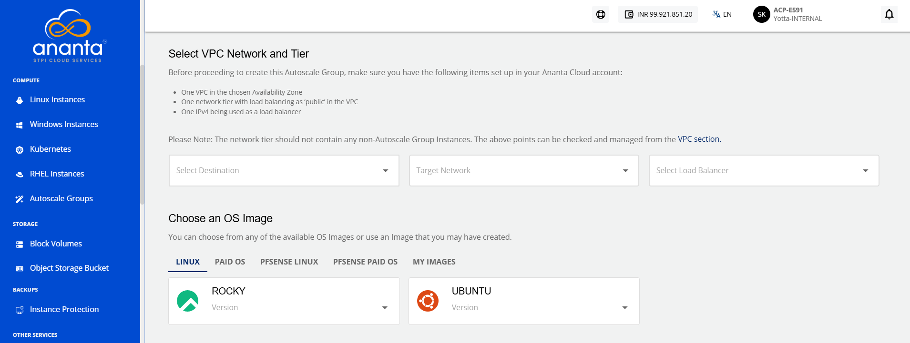
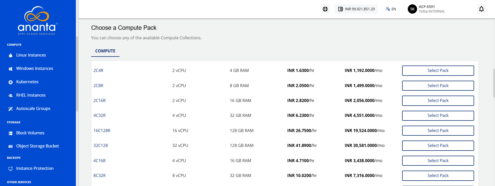
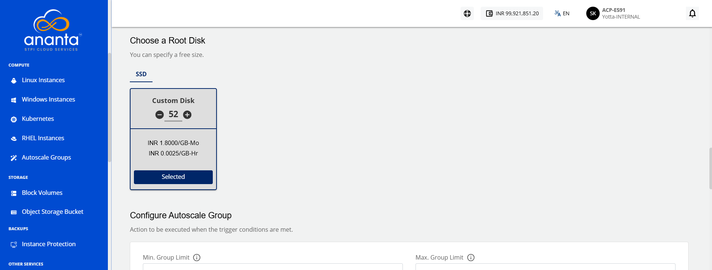
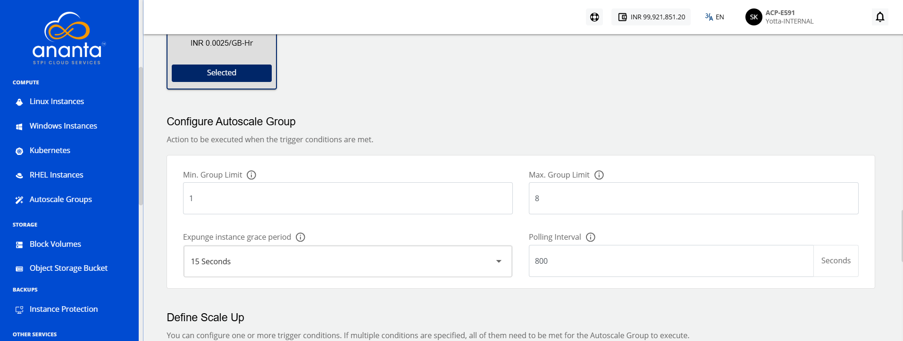
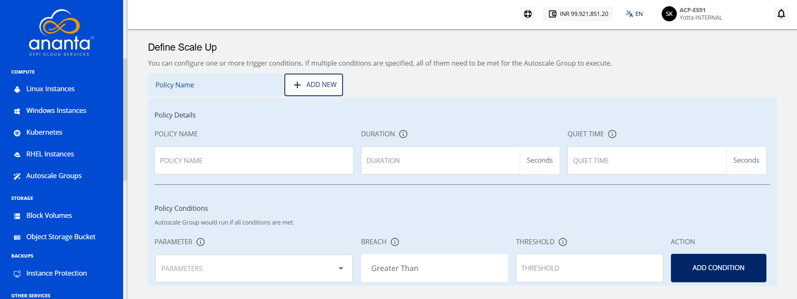
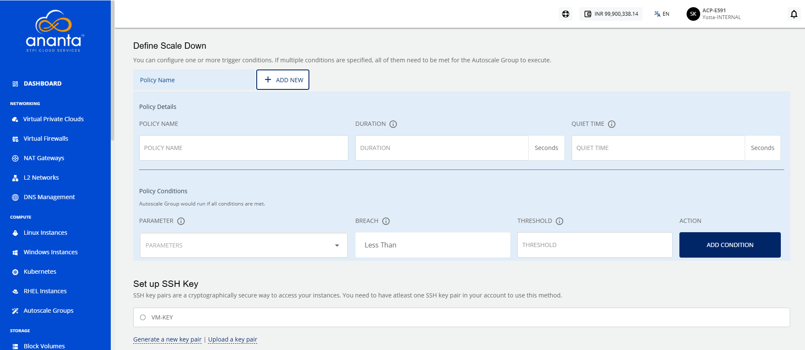
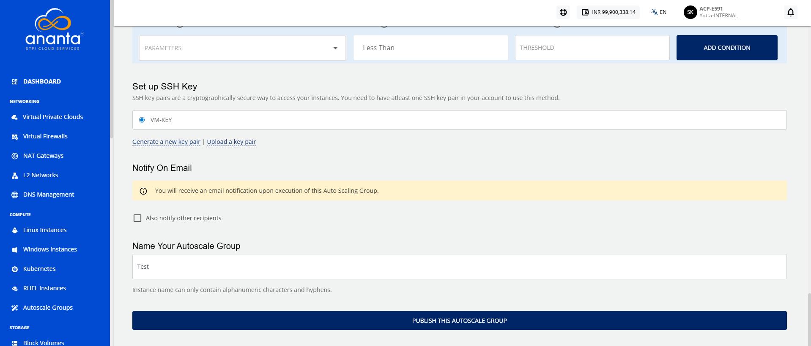

# Creating Autoscale Groups

To create Autoscale Groups, follow these steps:

1. Navigate to the **Compute > Autoscale Groups** in the navigation menu.
2. Click the **NEW AUTOSCALE GROUP** button. The following screen appears: 
   
3. Select an **Instance Category**. 
4. Choose an **Availability Zone** that represents the geographic region for the deployment of your Autoscaled Instance.
5. **Select VPC Network**, choose the appropriate tier in **Select a Network Tier**, and then select a load balancer from the options in the **Select Load Balancer** dropdown.
6. Choose an **OS Image** to run on your Instance.
7. Choose a **Compute pack** from the available compute collections.
8. Choose a **Root disk** from the available Disk packs, or alternatively, use the free size option to define the size of the Root Disk.
9. Configure the **Autoscale group** as per your requirement; the following options needs to be specified:
	- **Min. Group Limit:** This is the minimum number of members in the Autoscale Group. The number of instances in the group will be equal to or more than this number.
    - **Max. Group Limit:** This is the maximum number of members in the Autoscale Group. The number of instances in the group will be equal to or more than this number.
    - **Expunge instance grace period:** This defines how long before a scale-down is executed should the app/user connections to an Instance be removed.
    - **Polling Interval:** This defines at what interval should the Autoscale Group check your policy conditions and execute the relevant Scale or Scale-down configurations.
      :::note
	    The **Polling Interval** must be between 60 and 3600 seconds.
	    :::
	
10. Define the **Scale Up policy** (Multiple policies can be configured; if multiple conditions are specified, all of them need to be met for the Autoscale Group to execute). You need to specify the following:
	- **Policy Name**: Specify the name for your policy.
	- **Duration (in mins)**: This is the duration in which the conditions have to be true before action is taken.
	- **Quiet Time (in mins)**: The cool-down period in which the policy should not be evaluated after the action has been taken.
	- **Parameter**: Name of the counter for which the policy will be evaluated.
	    - **Parameters**: The performance parameters expose the state of the monitored Instances. As of now, there are five new parameters to work with that feature:
			- **Instance CPU**: average percentage
			- **Instance Memory**: average percentage
			- **Public Network**: mbps received per Instance
			- **Public Network**: mbps transmit per Instance
			- **Load Balancer**: average connections per Instance
	- **Breach**: Relational Operator to be used with threshold. This will be greater than by default.
	- **Threshold**: It is the value for which the counter will be evaluated with the operator selected.
11. To add the policy, click the **ADD CONDITION** button. If you want to add more policies, click the **ADD NEW** button present beside the Policy name.
12. Define the **Scale Down Policy**; the parameters are similar to the Scale UP policy. Only the breach parameter will be greater than by default.
    
    :::note
		The reading **DURATION** must be at least 60 seconds. The **QUIET TIME** must be between 120 and 3600 seconds.
	:::
13. Next is to set up the SSH Key. If your account doesn’t have any SSH key pair, then you can use the **Generate a new key pair** option, and you can also upload the key by selecting the **Upload a key pair** option.
14. If you want to notify your users or custom email addresses upon the execution of this Autoscale Group, then you can select the appropriate option available under Notify on email. For example: Notify to account users, Notify to comma-separated email addresses.
15. Specify name of your Autoscale group. (Use the naming convention mentioned in the helper text below.)
16. Click the **PUBLISH THIS AUTOSCALE GROUP** button for publishing the Autoscale group.
    

