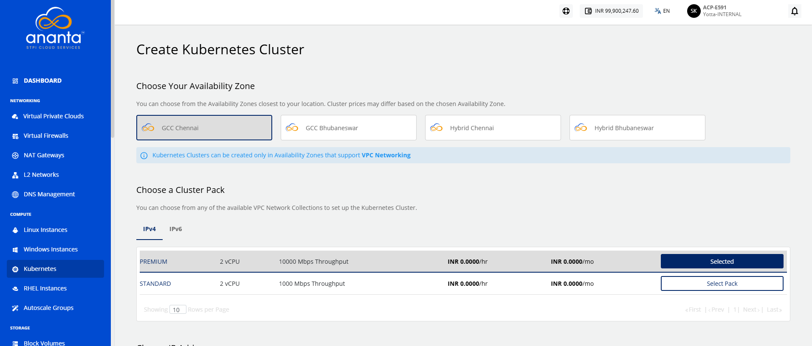
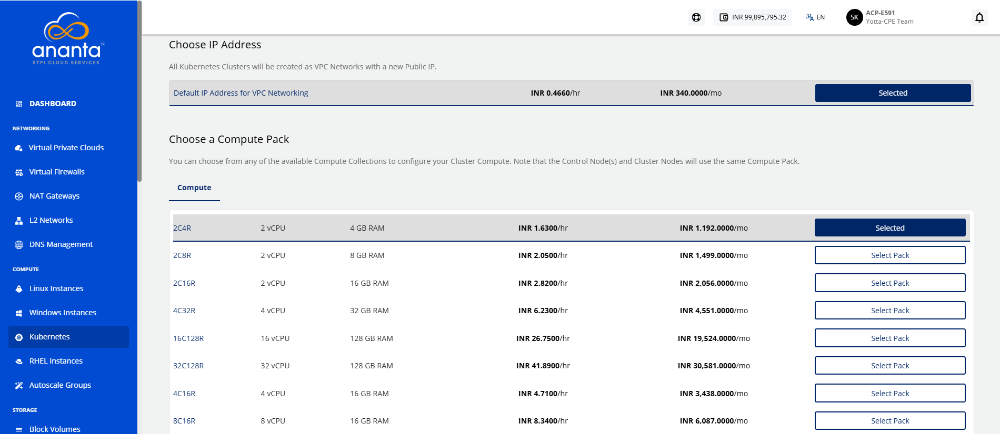
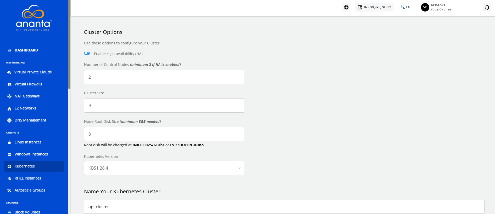
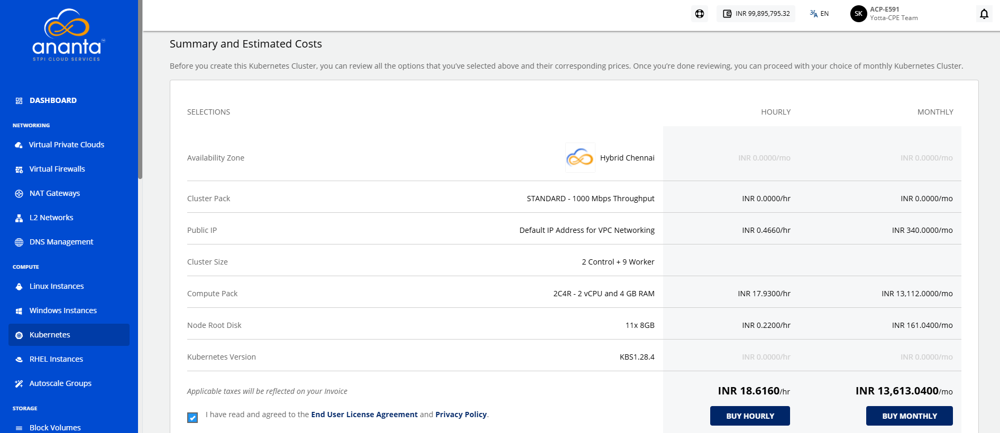

# Creating a Kubernetes Cluster

A Kubernetes cluster is a managed environment for deploying and managing containerized applications. Creating a Kubernetes cluster enables you to automate application deployment, scaling, and management while ensuring high availability, efficient resource utilization, and simplified operations across your cloud environment.

To create a Kubernetes cluster, follow these steps:
1. Navigate to **Compute > Kubernetes**. The following screen appears:
	
2. Click the **New Kubernetes Cluster** button. The following screen appears:
3. Select an Availability Zone.
4. Select a cluster pack from the list.
5. Select the required IP address configuration for the cluster.
6. Choose a **Compute Pack** from the available compute collections.
7. You need to define the various cluster options listed below:
    1. You can enable the high availability HA for the cluster.
    2. Specify the cluster size (For example: The no. of worker nodes). 
    3. Specify the node root disk size; a minimum of 8GB is required.
    4. Choose Kubernetes version (To learn how to access the dashboard from version 1.24 onwards, refer to [Accessing the Dashboard](Accessingthekubernetesdashboard.md)).
8. Enter the Kubernetes cluster name in **Name Your Kubernetes Cluster**.
9. Select the **I have read and agreed to the** **End User License Agreement** and **Privacy Policy**. option, and click the **Buy Monthly** or **Buy Hourly** button.
    

:::note
	This might take up to 5-8 minutes. You may use the Cloud Console during this time, but it is advised that you do not refresh the browser window.
:::

