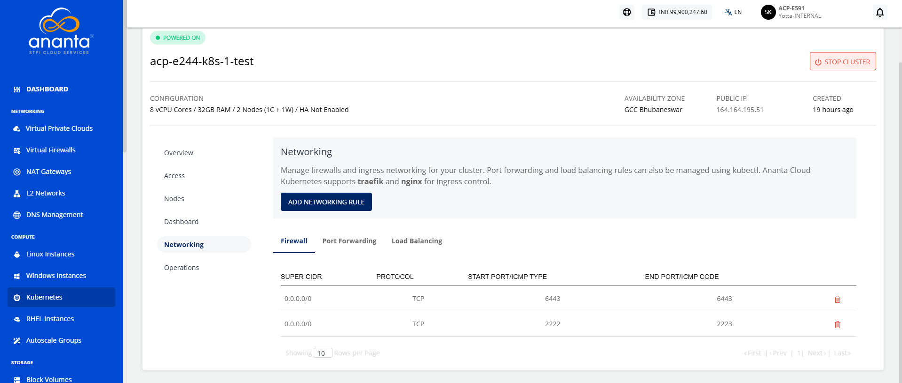
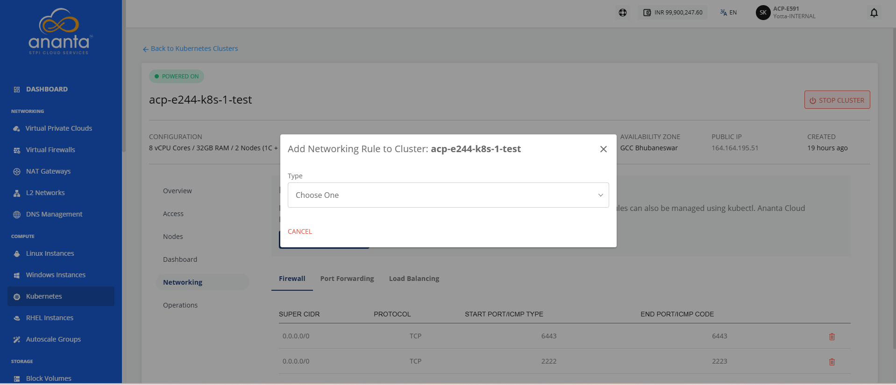
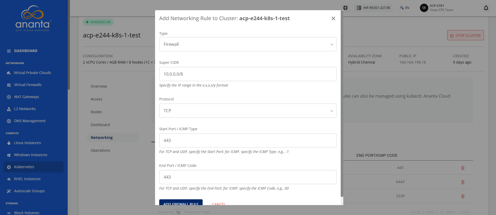
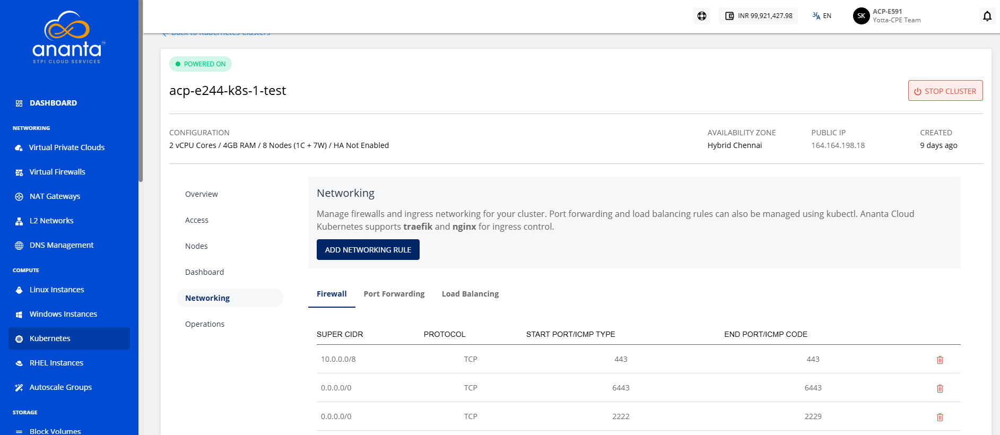
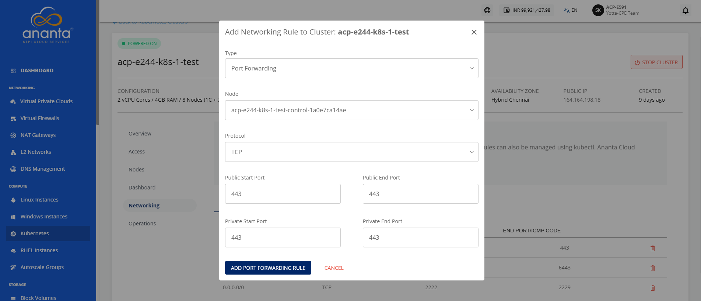
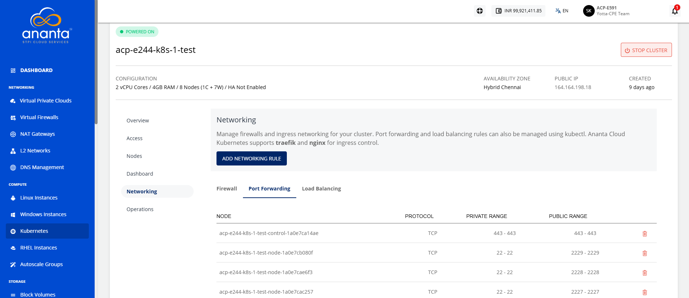
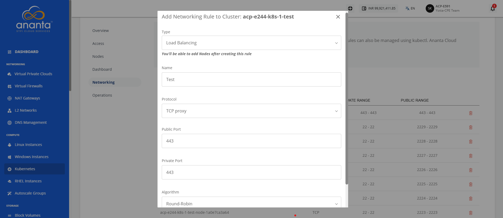
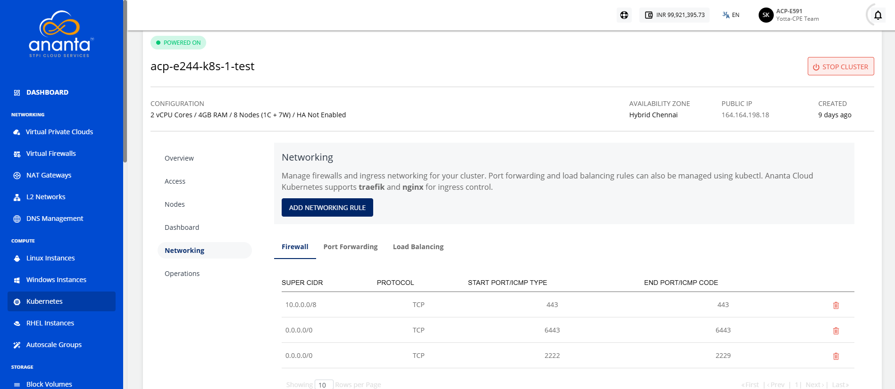

# Managing Network Rules

Managing network rules enables you to control and regulate network traffic for Kubernetes workloads by configuring essential networking rules. It provides options to define firewall rules for traffic filtering, create port forwarding rules for secure access to applications, and configure load balancing rules to distribute incoming traffic across multiple resources.

These capabilities help ensure secure, reliable, and efficient network communication within the Kubernetes environment.

:::note
Ananta Kubernetes Service supports traefik and nginx ingress controllers.
:::

## Adding a Firewall Rule to Cluster

Firewall rules control inbound and outbound network traffic to Kubernetes clusters, helping secure applications and services by allowing or denying access based on defined ports, protocols, IP addresses, or network ranges. Adding a firewall rule ensures that only authorized traffic can reach cluster resources while protecting workloads from unauthorized access.

To add a firewall rule, follow these steps:

1. Navigate to **Compute > Kubernetes**. The following screen appears:
2. Click on your created Kubernetes cluster name from the list.
3. Click **Networking**. The following screen appears:
4. Click **Add Networking Rule** button. The following screen appears:
5. Click the **Firewall** rule from the dropdown. The following screen appears, where you provide the required details: 
6. Click the **Add Firewall Rule** button. The following screen appears: 

## Adding Port Forwarding Rule

Add a port forwarding rule to securely forward traffic from a specified external port to a target port on a Kubernetes service or pod. Port forwarding enables temporary access to applications running inside the cluster for testing, debugging, development, or administrative tasks without exposing them publicly.

To add a port forwarding rule, follow these steps:

1. Navigate to **Compute > Kubernetes**. The following screen appears:
2. Click on your created Kubernetes cluster name from the list.
3. Click **Networking**. The following screen appears:
   4. Click the **Add Networking Rule** button.
5. Select **Port Forwarding Rule** option from the dropdown. The following screen appears where you provide the required details:
6. Click the **Add Port Forwarding Rule** button. The following screen appears:

## Adding Load Balancing Rule

Add a load balancing rule to distribute incoming network traffic across one or more Kubernetes services or application instances. Load balancing improves application availability, scalability, and reliability by ensuring traffic is evenly routed to healthy backend workloads, helping maintain consistent performance and minimize service disruptions.

To add a load balance rule, follow these steps:

1. Navigate to **Compute > Kubernetes**. The following screen appears:
2. Click on your created Kubernetes cluster name from the list.
3. Click **Networking**. The following screen appears:
   4. Click the **Add Networking Rule** button.s
5. Select the **Load Balancing Rule** option from the dropdown. The following screen appears where you provide the required details:
6. Click the **Add Port Forwarding Rule** button.