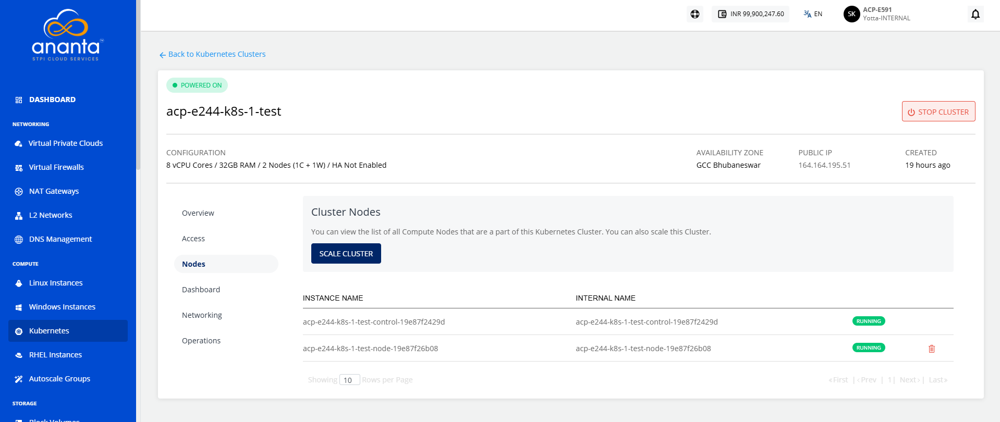
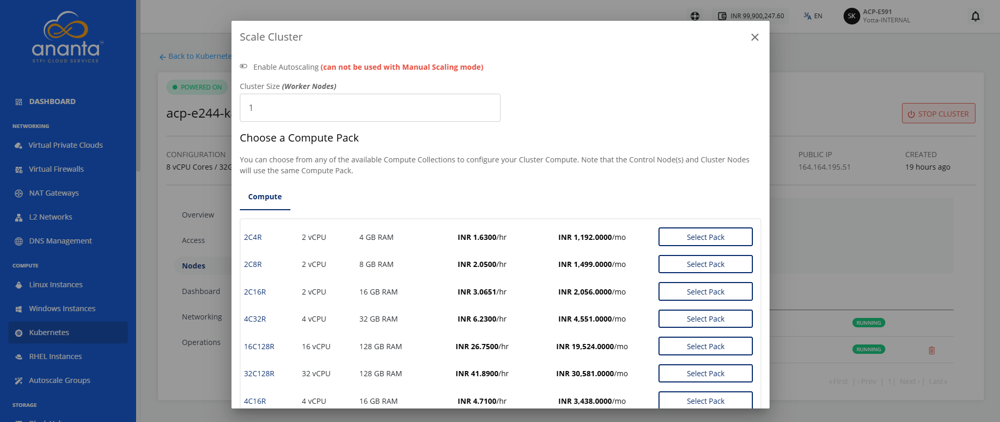
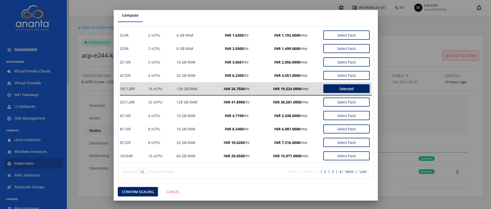
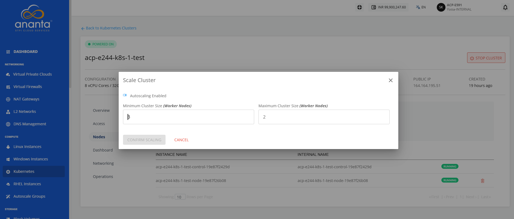

# Scaling Kubernetes Clusters

Ananta Cloud Console allows for manual and automatic cluster scaling. Navigate to **Compute > Kubernetes**, click the particular **Kubernetes cluster**, and select the **Nodes** tab.

## Manually Scaling a Cluster

To manually scale a cluster, follow these steps:

1. Under **Nodes**, click on **SCALE CLUSTER**, and a pop over will appear; keep **autoscaling** disabled.
2. Select one of the available compute packs.
3. Click on **CONFIRM SCALING**. 
## Automatically Scaling a Cluster

To automatically scale a cluster, follow these steps:

1. Navigate to the **Nodes** tab, click on **SCALE CLUSTER**, and a popover will appear, enable **autoscaling** by flipping the switch.
2. Enter the minimum and maximum number of worker nodes.
3. Click **CONFIRM SCALING**.
   

:::note
If the **Scale** operation fails, stop the cluster and retry the process.
:::