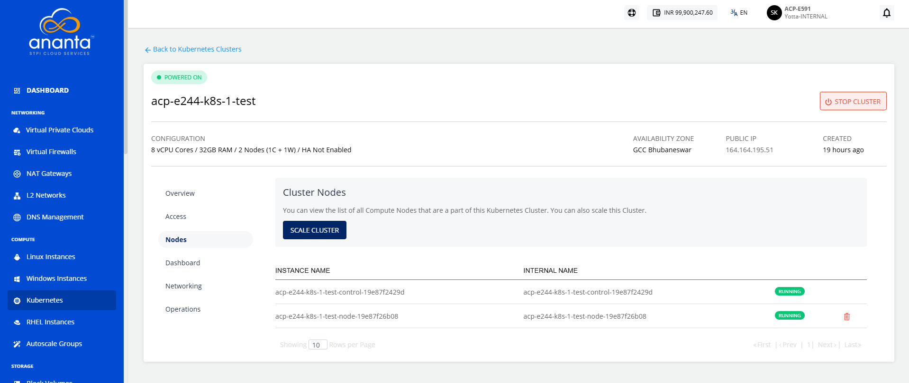
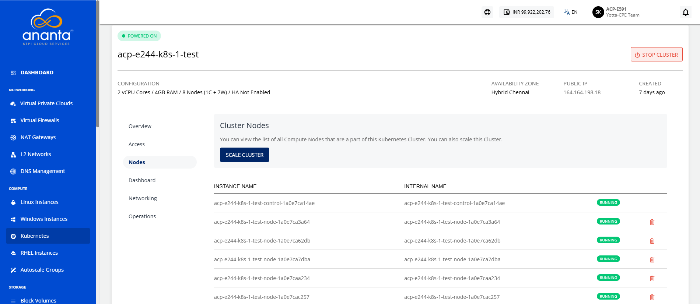
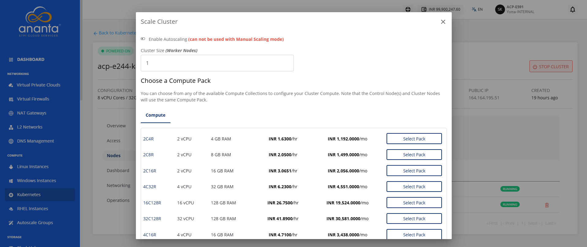
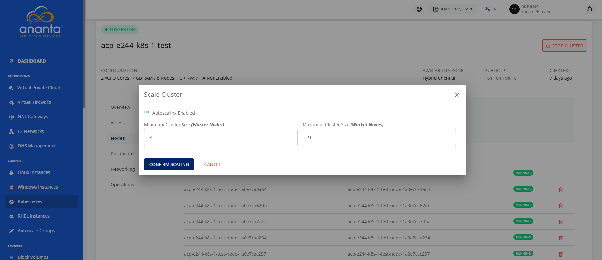

# Scaling Kubernetes Clusters

Scaling a Kubernetes cluster allows you to adjust its compute capacity by increasing or decreasing the number of worker nodes based on workload demands. This helps maintain application performance, optimize resource utilization, and ensure high availability while efficiently managing infrastructure costs.

## Manually Scaling a Cluster

To manually scale a cluster, follow these steps:

1. Navigate to **Compute > Kubernetes**. The following screen appears:
2. Click on your created Kubernetes cluster name from the list.
3. Navigate to **Nodes**. The following screen appears: 
4. Click the **Scale Cluster**. The following screen appears:
5. Keep **Enable Autoscaling** option disable and select one of the available compute packs.
6. Click the **Confirm Scaling** button.
## Automatically Scaling a Cluster

To automatically scale a cluster, follow these steps:

1. Navigate to **Compute > Kubernetes**. The following screen appears:
2. Click on your created Kubernetes cluster name from the list.
3. Navigate to **Nodes**. The following screen appears: 
4. Click the **Scale Cluster**. The following screen appears:
5. Enable the Autoscaling, the following screen appears:
6. Enter the **Minimum Cluster Size** and **Maximum Cluster Size**.
7. Click the **Confirm Scaling** button.

:::note
If the **Scale** operation fails, stop the cluster and retry the process.
:::