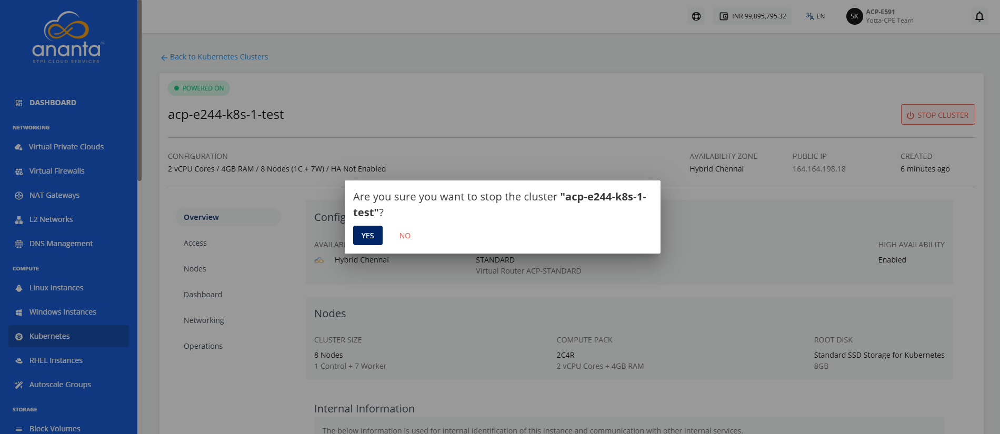
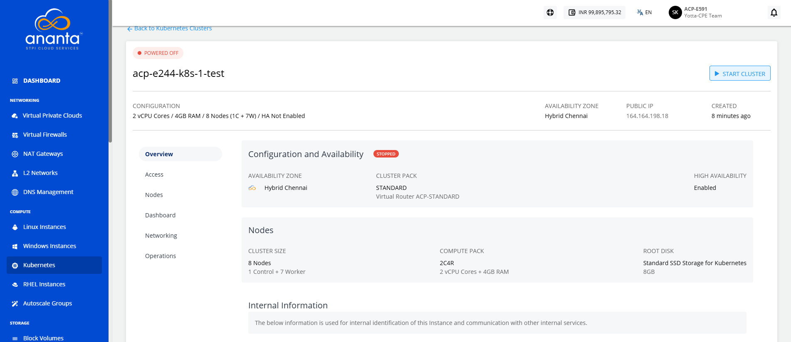
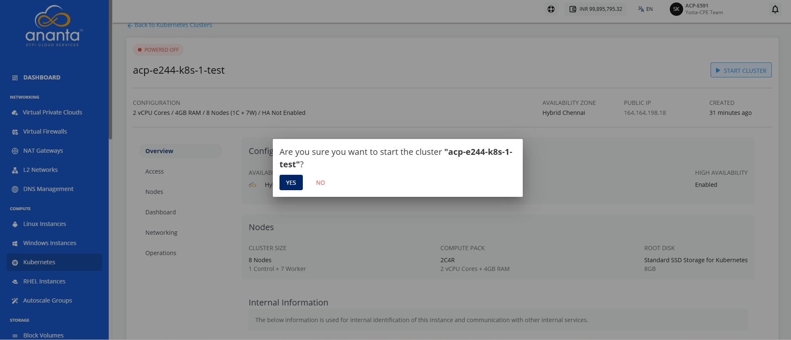

# Stopping and Starting a Kubernetes Cluster

Stop and start a Kubernetes cluster to perform maintenance, troubleshoot issues, or manage resource usage. Stopping the cluster temporarily suspends its operation, while starting it restores the cluster and its services, allowing your containerized workloads to resume normal operation.

To stop and start a Kubernetes cluster, follow these steps:

1. Navigate to **Compute > Kubernetes**. The following screen appears:
2. Click on your created Kubernetes cluster name from the list.
3. Click the **Stop Cluster** button. The following screen appears: 
4. Click the **Yes** button. The following screen appears:
5. Click the **Start Cluster** button. The following screen appears: 
6. Click the **Yes** button.
