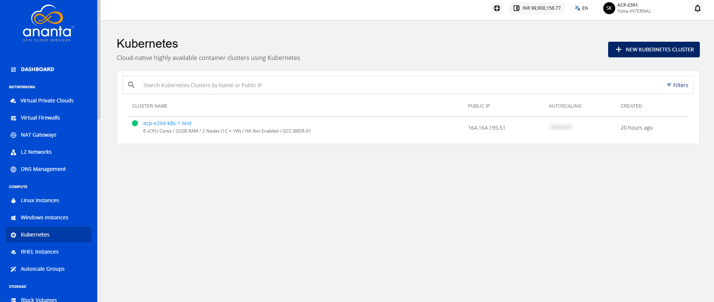

# Viewing Kubernetes Clusters

View Kubernetes clusters and access essential details such as cluster name, public IP address, autoscaling configuration, and creation date. Monitor cluster information from a centralized view to quickly review configurations and manage your Kubernetes environments efficiently.

To view the Kubernetes cluster, navigate to **Compute > Kubernetes**. The following screen appears:

