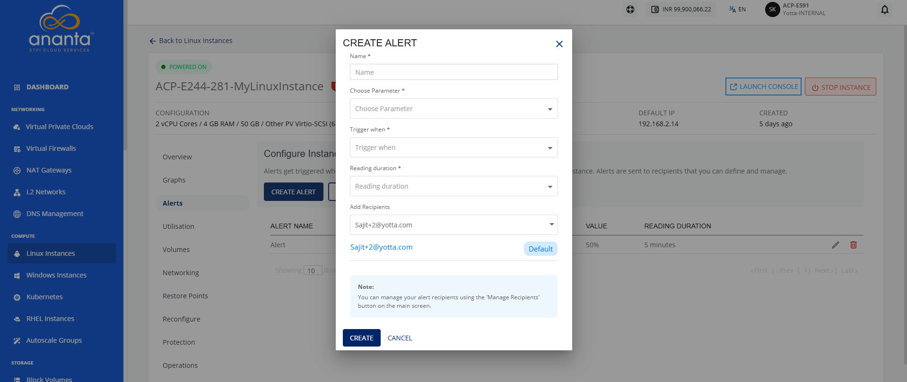
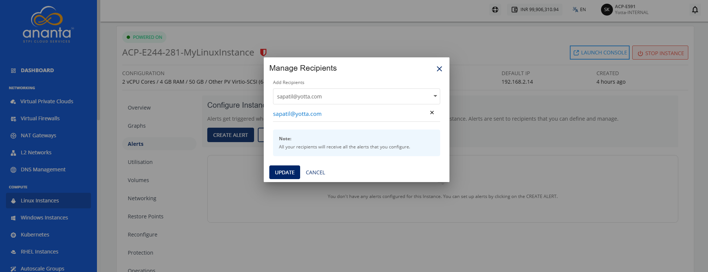

# Configuring Alerts on Linux Instances

Alerts get triggered whenever a configured condition is met. You can create multiple alerts on an instance. Alerts are sent to recipients that you can define and manage.

You can configure alerts for instances running on NGC. You can define alerts for Instances and configure the email recipients for these alerts using an easy-to-use interface.

Navigate to **Compute > Linux Instance,** click the particular **Linux Instance Name,** and access the **Alerts** tab.
## Instance Alerts

The Alerts tab lists all the alerts already configured for that particular Linux Instance. In addition, it will show the following details:
- Name for the alert
- Parameter
- Trigger When
- Value
- Reading Duration
 
## Creating an Alert

To create an alert, follow these steps:

1. Click the **Create Alert** button. The following screen appears:    
2. Provide the following details:
	- **Name**: You can define the name for your alert.
	- **Choose Parameter**: This option allows you to define what parameter needs to be monitored to trigger the alert email. The NGC supports CPU, RAM, Disk, 1-min Load Average, 5-min Load Average, and 15-min Load Average parameters.
	- **Trigger when**: This set of options lets you define whether to trigger above or below a custom value.
	- **Reading duration**: This option lets you define the breach window, that is, the duration for which the breach must be consistent to trigger the alert email.
	- **Add Recipients**: This option lets you add recipients from the dropdown.

## Configuring Recipients

You can delete the existing email IDs and add other email IDs by following these steps:

1. Click the **Manage Recipients** button. The following screen appears:
2. Click the dropdown icon in the **Add Recipients** field to view the recipients list.
3. Select the recipients from the dropdown.
4. Click the **Update** button.
 

:::note
All configured recipients will receive the setup alerts. If no email ID is added, no emails will be sent for the configured alerts.
:::
