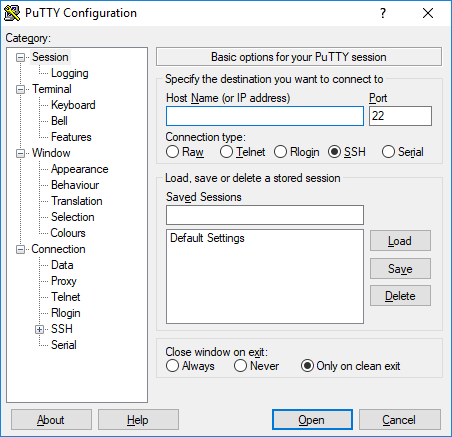
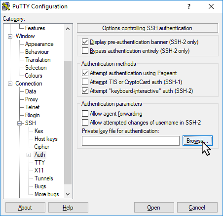

# Connecting to a Linux Instance

After creating a Linux instance, you can connect to it remotely to perform administrative tasks, install software, configure applications, and manage system resources. Secure Shell ([SSH key pairs](/docs/Guide/ToolsandUtilities/ManagingSSHKeysandKeyPairs))  is the standard method used to establish a secure connection to a Linux instance. Depending on your operating system, you can connect to the instance using different tools and methods.

This section comprises of the following sub-sections:
- [Connecting an Instance from a Windows Machine](#connecting-an-instance-from-a-windows-machine)
- [Connecting an Instance from a macOS or Linux Machine](#connecting-an-instance-from-a-macos-or-linux-machine)

## Connecting an Instance from a Windows Machine

You can connect to a Linux instance from a windows machine using PuTTY, an SSH client that enables secure remote access. Before connecting, ensure that you have the instance's public IP address and the corresponding private SSH key.

1. [Download and install PuTTy.](https://www.chiark.greenend.org.uk/~sgtatham/putty/latest.html)
2. Launch PuTTy on your computer.
3. In the **Host Name (or IP Address)** field, enter your Instance’s IP address.   
   
4. Navigate to **Connection** > **SSH** > **Auth**.
	  
5. Click the **Browse** button and select the previously generated private key file.
6. To open a connection to the instance, click **Open** at the bottom of the screen. PuTTY prompts you to allow the connection to the host.
7. Click **OK** to confirm. The terminal screen appears.
8. Enter the default root username (typically **ubuntu** for Ubuntu images and **root** for other Linux OS images) and press **Enter** to authenticate using your SSH key.

You are now connected to your Instance.

## Connecting an Instance from a macOS or Linux Machine

You can connect to a Linux instance from a macOS or Linux machine using the built-in terminal application and the SSH command. Ensure that you have the instance's public IP address, the appropriate user name, and the private SSH key used during instance creation.

To connect a Linux instance from a mac or Linux machine, follow these steps:

1. Open any terminal program.
2. Enter the following command into the terminal.    
   :::important 
   Make sure you replace `<your_private_key>` with the filename of your private key; `<your_instance_ip>` with the IP address of your Instance; and `<username>` with the default root user name (typically **ubuntu** for Ubuntu images and **root** for all other Linux OS images).
   :::
	```
	ssh -i ~/.ssh/<your_private_key> <username>@<your_instance_ip>
	```
3. If/when prompted, allow connection to the host by typing **yes**, then press **Enter**.
	```
	The authenticity of host 'myhost.ext (212.47.206.34)' can't be established.  
	RSA key fingerprint is 4f:ba:65:cf:14:64:a7:1e:b6:07:7c:00:71:95:21:fa.
	Are you sure you want to continue connecting (yes/no)?
	
	You are now connected to your Instance.
	```


