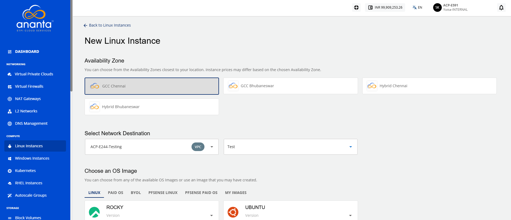
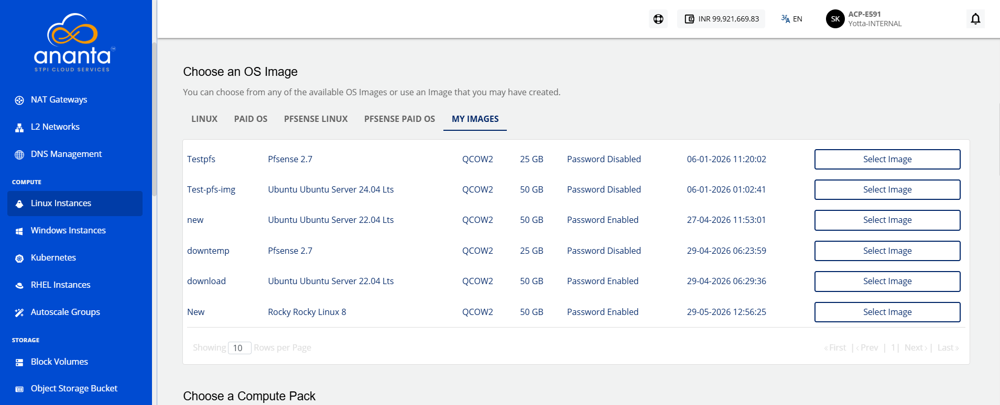
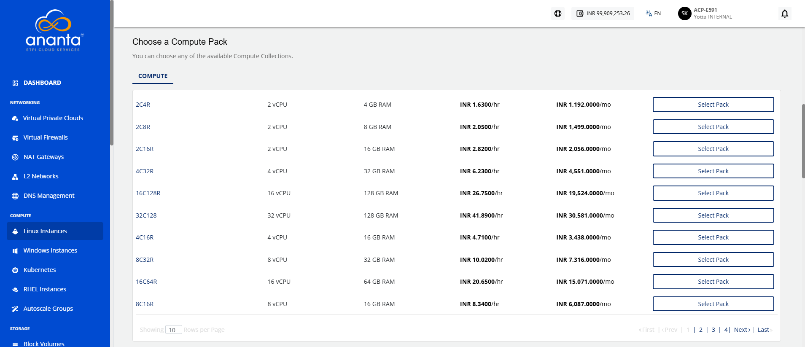
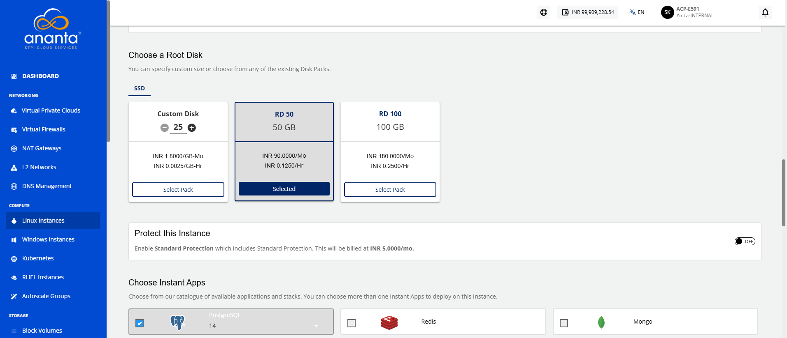
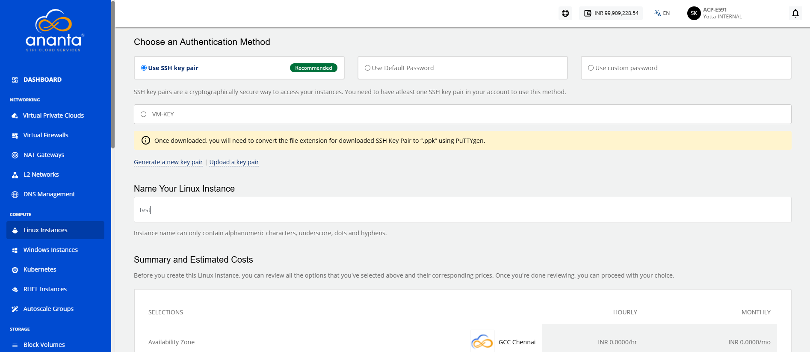
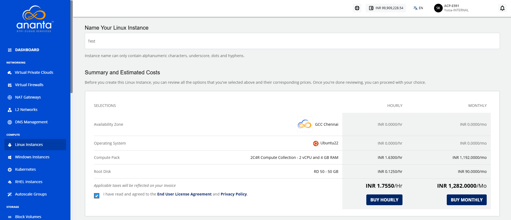
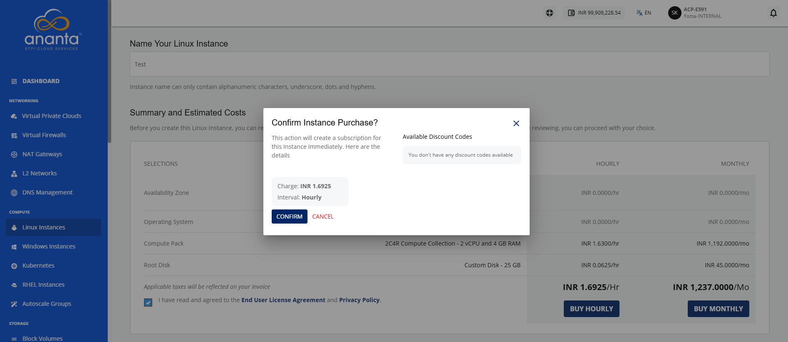

# Creating Linux Instances

Create a Linux instance to deploy a instance for running Linux-based applications and workloads in the cloud. During creation, you configure the required compute, storage, networking, and other settings to provision an instance that meets your workload requirements.

To create a Linux instance, follow these steps:

1. Navigate to **Compute > Linux Instances**. The following screen appears:
2.  Click the **New Linux Instance** button. The following screen appears:
    
    
3. Choose an **Availability Zone**, which is the geographical region where your Instance will be deployed.
4. Select the **Destination** (VPC/VNF) and then the **Network** from the respective drop-down lists.   
5. **Choose an OS Image** to run on your Instance. You can also select the image from the **My Images** tab.
	:::note
	  To learn how to upload a custom instance image, refer to the [Uploading Custom Image](/docs/Guide/ToolsandUtilities/ManagingCustomTemplatesandImages#uploading-custom-image) page.
	:::
6. **Choose a Compute Pack** from the available compute collections.
7. **Choose a Root Disk** from the available options.
   :::note
    The Ananta offers both encrypted and non-encrypted offerings. To learn more about it, refer [Disk Offerings](/docs/Knowledgebase/WhatareDiskOfferings).
	:::
8. In **Choose Instant Apps**, select the available applications. To Verify/Login into your selected database, refer to [App Overlays](/docs/Guide/Compute/LinuxInstances/AppOverlays). 
    
    
9. **Choose an Authentication Method**:
    - **Use SSH key pair**: To view all the SSH key pairs present in your account, click the **Use SSH key pair** option. If your account doesn’t have any SSH key pair, then you can click the **Generate a new key pair** or upload the key pair by clicking the **Upload a key pair** option.
    - **Use Default Password**: On selecting **Use Default Password**, the system automatically generates a password for the instance. You can view or copy this password from the instance details page after creation and use it to log in.
    - **Use Custom Password**: On selecting **Use Custom Password**, you are required to enter and confirm your own password. This password is used to access the instance after it is created. Ensure the password meets the required security criteria.
10. Enter the name for your Linux instance in **Name Your Linux Instance**.
11. Select the **I have read and agreed to the End User License Agreement and Privacy Policy** option, and then click **Buy Hourly** or **Buy Monthly** button. 
	
    
12. Click the **Confirm**  button.

:::note
It might take up to 5-8 minutes for the Linux instance to get created. You may use the Cloud Console during this time, but it is advised that you do not refresh the browser window.
:::

Once ready, you receive a notification of this purchase at your email address. To access the newly created Linux instance, navigate to **Compute > Linux Instances** on the main navigation panel.
