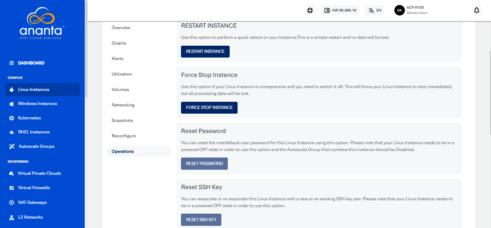
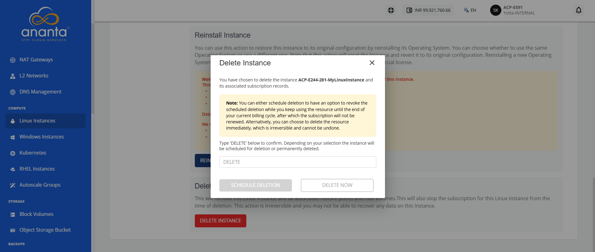

# Linux Instance Operations

To view all available Instance operations, navigate to **Compute > Linux Instances**, click the Linux Instance Name, and access the **Operations** tab.

Ananta Cloud Console provides the options to perform the following operations on Linux Instances:

- **Restart Instance**: Perform a quick reboot on your Instance. This is a simple restart, and no data will be lost.
- **Force Stop Instance**: Force stop a running or a hung Linux Instance.
- **Reset Password**: Reset the Linux Instances root user password. This requires the Linux Instance to be powered off.
- **Reset SSH Key**: Reset the Linux Instances SSH key association. This requires the Linux Instance to be powered off.
- **Rename Instance**: Rename the Linux Instance.
- **Migrate Instance**: Migrate Linux Instance between VPC networks within the same Availability Zone.
- **Reinstall Instance**: Restore this Instance to its original configuration by reinstalling its Operating System or choosing a new one. Choosing a new Operating System image may have an additional billing component if it is a priced Operating System.
- **Delete Instance**: Type DELETE in the provided field, and click the Schedule Deletion or Delete Now button based on your requirements.
  :::warning
  Deleting a Linux Instance will remove it entirely along with its subscription and is a non-reversible action.
  :::

